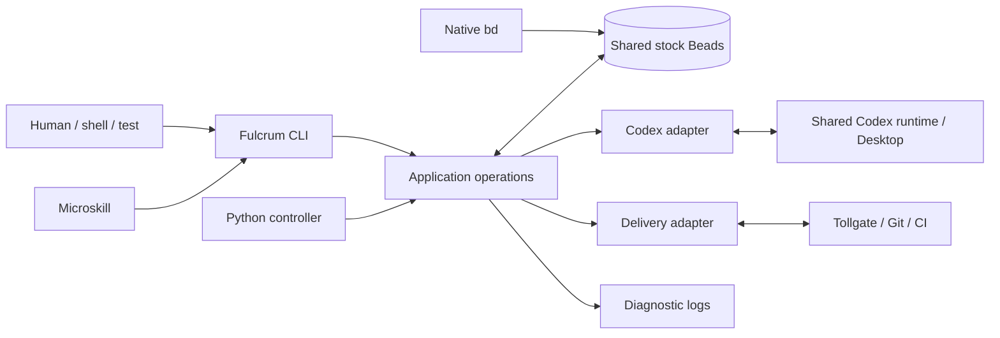

# Fulcrum 2.0 technical design

Status: approved design scope, specified for implementation. This document describes
the replacement; it does not assert that the commands below already exist.

Read [contracts.md](contracts.md) for the complete executable interfaces and data
contracts, and [failure-analysis.md](failure-analysis.md) for the operational
evidence and recovery sequences. These three documents supersede the old Fulcrum
design for the replacement. They introduce no compatibility or migration path.
[audit.md](audit.md) records requirement coverage, retained capabilities, and
intentional removals; the design and contracts remain normative.

## 1. Decisions and intended outcome

Fulcrum is a local, single-user coordinator of work across enrolled Git projects.
Its durable unit of work is a Beads issue. Its execution surface is a real Codex
Desktop task. Its complete control surface is the `fulcrum` CLI. A user can operate
and test the entire installation from a terminal, without invoking a skill or
driving the Desktop UI.

The system consists of:

1. One **stock Beads ledger**, using its Dolt backend, shared across projects.
2. One **small Python controller**, which performs mechanical transitions and
   supervises external operations.
3. **Eight agent roles**, which make decisions and perform their assigned work.
4. A **Codex adapter** for the shared Desktop runtime.
5. A **delivery adapter**, initially implemented with Tollgate.
6. A **CLI and small skills** that call the same application operations.

Fulcrum owns no SQLite database, private SQL tables, JSON workflow journal, or
event-replay database. Beads metadata is authoritative for coordination. Git and
the delivery provider remain authoritative for source and delivery. Codex remains
authoritative for native task and turn state. Diagnostic files are evidence, not
an alternative source from which the controller reconstructs workflow state.

Moving existing tables into a giant Beads JSON object would preserve the old
architecture's problems. The replacement has no runs, numeric lineages,
Executor/Overseer pairs, interview occurrences, frozen scope-reference tables,
separate publication obligations, or role-specific retry engines. A work bead has
one current owner, one current phase, and an explicit next action. A significant
external mutation has one inspectable operation receipt in Beads.

**Continuous supervision is required; recurring agent jobs are excluded.** The
persistent Python controller acts as a watchdog: it consumes runtime events and
periodically checks existing work for stale owners, stalled agents, incomplete
handoffs, and uncertain operations. It applies bounded mechanical recovery and
escalates judgment to Marshal, which may dispatch Justiciar. This supervision
runs automatically without the user requesting each check; it is not a recurring
model-powered patrol.

User initiation governs the origin of work, not every subsequent controller
action. Operational polling, retry deadlines, inactivity detection, and one-time
archival timers maintain that work. There are no cron or heartbeat agent jobs,
recurring Sage/Mason reviews, calendar dispatch, or periodic self-improvement
assignments. `serve --once` and `reconcile` expose the same supervisory processing
to tests and terminal users. Section 6 specifies the polling and escalation rules.

### Product requirements

- An agent that understands ordinary `bd` can file work with `--assignee executor`
  or another role. Enrollment supplies the project context.
- An agent can read a bead and find the outcome, current evidence, executable next
  action, and completion instructions without prior Fulcrum knowledge.
- Every work item has accountable ownership, including raw intake, backlog,
  blocked work, recovery, and closure.
- Direct human role invocation begins immediately. Marshal approval and ordinary
  admission limits do not delay it.
- Ordinary handoff is one-way: Executor finishes; Warden reviews, fixes, and ships.
- Broken infrastructure must not make investigative skills refuse to begin.
- Support 30 simultaneously active native workers without resource exhaustion
  caused by retained Fulcrum subscriptions. Keep Desktop usable alongside them.
- Reduce coordination turns and repeated work before trying to optimize model
  pricing. Telemetry must not become a prerequisite for delivery.

## 2. Components and authority

CLI and controller call the same Python service functions. The CLI does not shell
out to itself; the service does not require an agent tool. Normal mutations go
over a local Unix socket to the controller. If it is stopped, the CLI can execute
the same operation after acquiring the installation's writer lock. Offline
execution is a normal operating mode, not a second implementation.

The installation has one OS advisory writer lock, held for the controller's
lifetime or an offline command's duration. Per-bead asynchronous work queues keep
operations ordered; a short in-process critical section serializes ledger writes
and admission decisions. Never hold that section while waiting for CI or a model
turn. Recoverable intent is committed before starting such external work.

The lock serializes **Fulcrum** writers. Stock `bd` callers do not participate in
that lock. Consequently, native assignee changes are requests that Fulcrum
normalizes, not distributed locks. The precise ownership rule and concurrency
limits are in [contracts.md](contracts.md#ownership-and-native-writes). Do not claim
that stock Beads supplies arbitrary compare-and-swap metadata updates or that an
advisory lock prevents a local user from directly editing Git.

### Implementation boundaries

Use a small package organized around `application`, `ledger`, `runtime`,
`delivery`, `controller`, `cli`, `context`, and `diagnostics`. These are modules or
small packages, not services. Keep transition rules in application operations;
adapters return facts and classified failures. Do not put policy decisions or
role prompt text in adapters.

Use `asyncio`, `argparse`, and a maintained WebSocket library for the runtime
connection; remove the handwritten WebSocket framing. Invoke stock `bd` and `tg`
with argument arrays, absolute executable paths, bounded output capture, and
timeouts. Fulcrum never imports Beads internals or writes its database directly.

Keep the core internal API small: `enter`, `update_work`, `decide`, `transfer`,
`finish`, `reconcile`, and adapter-backed resource operations. The broader CLI
names convenient operations for users; it does not justify one engine or state
machine per command. Each public operation has input validation, an ownership
check, a recorded mutation plan when needed, and a postcondition inspector.

Controller code runs from an installed package, not an editable project worktree.
Preserve automatic source refresh through a quiescent installed-package swap.
A source-change event or `service update` records a pending update, stops new
automatic dispatch, and waits for in-flight controller mutations to settle.
Build and import-check a separate installation before atomically activating it
and restarting with the writer lock retained or reacquired before reconciliation.
Running workers and delivery operations retain their Beads identities. A failed
installation leaves the working service active. Do not hot-load Python modules
in the middle of a transaction. Development installation into the
repository `.venv` remains available; the service uses its separate installed
environment. No new release-version scheme or source-content hashes are added.

## 3. Ledger, project context, and task context

### One ledger

The canonical workspace is `<instance>/ledger`; Beads uses one externally served
Dolt database named `fulcrum`. Enrolled repositories and managed worktrees have
local Beads configuration pointing to that same database, rather than separate
databases that need hydration. All issue IDs start `fc-`. Do not add role prefixes
to bead IDs or rename a bead on handoff.

Use native issue fields for title, description, acceptance criteria, priority,
status, and dependencies. Use one namespaced `fc` metadata object for operational
facts. Native `owner` is Beads' human attribution field and is **not** Fulcrum's
owner. The admitted owner is `metadata.fc.owner`; native `assignee` mirrors it
after routing. Control and operation issues use the same namespace and are
filtered out of ordinary work lists.

Project enrollment writes project-local `actor: project:<project-id>` into Beads
configuration. Stock Beads records it as `created_by`. All these local workspaces
share the same backend. Fulcrum-created issues carry an explicit `project:<id>`
label and `fc.project`; managed agent commands supply an actor containing both
project and task identity. Do not globally set `BEADS_DIR` to the central workspace
for ordinary project shells: that can suppress project-local configuration.

Project resolution is explicit CLI project, existing `fc.project`, a single
project label, or the configured `created_by` project, in that order. Conflicting
evidence is a Marshal clarification item, never a guess based on the controller's
current directory. Native callers that override the actor can use an ordinary
project label. Enrollment adds short Beads guidance explaining that convention.

### Context belongs with the work

Use one Beads formula per role, compiled with `bd cook --var ...`. Each has a single
`work` step and no materialized workflow-step issues. Copy the cooked step title
and description into the existing work bead through ordinary `bd create/update`.
Do not use `mol pour` to replace an existing bead on a role transition. True
multiple-task plans have a parent epic and actual deliverable children, not
children for “start”, “review”, or every retry.

Store user outcome and current handoff facts separately from the compiled
description in the same bead update so role changes cannot erase the original
request. The role formula consumes those fields and contains the prose. Python
only selects variables, invokes Beads compilation, and copies the output; it
does not compose nested role prompts or truncate task requirements.

The resulting description contains: requested outcome; project and worktree;
scope and acceptance; current role and next action; current evidence and blockers;
and exact CLI finish/help instructions. Historical logs are linked, not pasted.
The worker prompt is a fixed instruction to read the named bead and follow it.
`fulcrum context --bead ...` prints that material plus current ownership and
operation facts. Compaction recovery uses the same command.

All eight roles ship short static fallback instructions in the installed CLI;
Sage, Mason, and Justiciar additionally include emergency diagnostic guidance.
If `bd cook` or the ledger is unavailable, print the relevant instructions and
available evidence, continue useful diagnosis, and report `degraded` registration.
Do not fabricate a bead ID or write a second queue for later replay. Existing native
conversation history preserves the user's request until a real bead can be
created. Terminal-only invocation can receive the same guidance even if Codex is
unavailable; it cannot promise to have started a model in an unavailable runtime.

## 4. Roles and ownership lifecycle

### Persistent bead identity and visible task names

Remove exactly the leading `fc-` from the bead ID and prepend the current role
code inside brackets. For `fc-51o`, the same scope uses these exact titles:

| Role | Native task title |
| --- | --- |
| Vizier | `🔮 VIZIER 🔮` |
| Marshal | `🧭 MARSHAL 🧭` |
| Weaver | `🧵[wvr-51o] Design search indexing` |
| Executor | `🛠️[exe-51o] Design search indexing` |
| Warden | `🛡️[war-51o] Design search indexing` |
| Sage | `📖[sge-51o] Design search indexing` |
| Mason | `🧱[mas-51o] Design search indexing` |
| Justiciar | `🔥[jus-51o] Design search indexing` |

There is no space before `[`, role codes are lowercase, and the suffix is the
entire remaining bead ID, not a new role counter. Update the description when the
work's title changes. A replacement task may have the same visible title; its
native thread ID distinguishes it. Scoped specialists retain the investigated
bead's ID, while global/unrelated work receives a new bead. Parent and child beads
have their own IDs; a child's worker never displays its parent's ID instead.

### Golden rule

**Every bead has an owner; every open work bead has an accountable next action.**

Ownership is a Codex task ID or `HUMAN`. Native intake without admitted metadata is
stewarded by the current Marshal, as derived from the leadership control bead.
Thus `assignee=executor` means “Marshal must route this to an Executor,” not that a
nonexistent role string is doing the work. The adoption interval is visible.
When no Marshal exists, bootstrap or recovery work belongs to HUMAN until the
leadership identity is established. This is the explicit external-intervention
case, not an invisible unowned queue.

Only the admitted task may advance a work bead through ordinary CLI operations.
Each ownership acquisition gets a random claim token. Transfers invalidate the
previous token; old finish commands return an ownership-conflict result. Tokens
are non-secret concurrency identifiers, not authorization credentials or hashes.

| Situation | Accountable progress |
| --- | --- |
| Active worker | A next action, observed turn state, and substantive work checkpoints |
| Backlog | Marshal priority, waiting reason, and reconsideration trigger |
| Dependencies | Marshal tracks which prerequisite must change; the owner is not pinged repeatedly |
| Handoff | Old owner remains accountable until the destination exists and transfer commits |
| Recovering | Named recovery owner and a concrete repair operation |
| HUMAN | Specific required decision/action, surfaced once by Marshal |
| Closed | Last accountable owner retained; no ongoing progress obligation |

Updating timestamps, emitting logs, polling, or retrying an unchanged failure does
not count as substantive progress. A quiet but active long command is evidence of
liveness, not necessarily a deadlock. Use the finite detection policy below.

### Vizier and Marshal

Titles are exactly `🔮 VIZIER 🔮` and `🧭 MARSHAL 🧭`. Skills locate the existing
leader and route the user's explicit request there. Creating a request bead does
not require replacing the leadership task. Bootstrap creates both native tasks
without starting unsolicited Vizier work. No controller event, completion, or
HUMAN escalation sends a Vizier turn.

Vizier can change policy, suspend rules, and request repair. Policy is kept on its
control bead with a concise rationale. Marshal can make ordinary priority,
capacity, overlap, and recovery decisions within that policy. Defaults allow
progress without waiting for an initial policy-writing turn.

Marshal owns unstarted backlog and parents whose children are being implemented.
It may defer work indefinitely with an explicit reason. Reconsider deferrals on
relevant priority, policy, dependency, or capacity changes; display age without
manufacturing a new job to touch old work. Close duplicate work with a canonical
bead link and preserved useful evidence. Do not deduplicate by a text hash or
close two similar scopes without judgment.

### Weaver and incidental reporting

Weaver creates/adopts a bead at entry, then investigates or plans. It may answer a
question and close the bead as `answered` without creating implementation work.
Its read-only restriction concerns product source; creating beads, recording
findings, and authoring an explicitly requested design document are allowed.
An implementation-ready result goes to Marshal as the same bead. Multi-part work
uses an epic and independently meaningful children.

The small `$bead` skill calls `fulcrum report` from any conversation, before or after
that conversation finishes. Reporting does not rename or change the current role,
block promotion, require registration, or approve implementation. New reports are
Marshal-owned backlog. A report outage is surfaced as a report failure; it does
not revoke a successfully completed implementation.

### Executor and Warden

Executor owns a single work bead and isolated worktree. It may clarify incomplete
direct requests in the same task. A directly invoked Executor does not wait for
Marshal approval; unspecified details must still be resolved before risky edits.
Ordinary dispatch requires an actionable outcome, identified project, and
proportionate acceptance checks. Questions about missing scope route to Weaver or
Marshal instead of repeatedly starting implementations that cannot succeed.

Executor implements, runs relevant checks, and commits. Preserve proportionate
behavioral verification, including boundary/error cases when material and rendered
evidence for visible UI changes. Stop owned background tools and finish or stop
helpers before handoff. Do not impose full end-to-end role execution on every
change. Executor does not push its worktree branch or promote source.
`finish --outcome ready_for_review` records source and evidence, invokes delivery preparation, and
arranges Warden ownership. Executor performs no further implementation after its
accepted handoff. If native termination has not yet been observed, the handoff
waits before starting Warden edits. The controller does not send Executor another
correction turn.

Warden reviews current source and acceptance evidence, not obsolete findings from
earlier commits. It either approves unchanged work or edits the same worktree and
fixes issues itself. New source invalidates approval of the previous source;
Warden revalidates and approves the resulting source. Warden need not recruit a
second reviewer for its fixes. A failed CI result remains Warden-owned work.
Unachievable requirements or repeated lack of progress escalate to Marshal and
Justiciar. Promotion, source synchronization, cleanup, and closure are observed
mechanically; source is not “unpromoted” because later cleanup failed.

### Sage and Mason

Sage examines workflow evidence, tools, prompts, and broken world state. Mason
examines architecture, responsibility boundaries, duplication, and tests whose
only value is detecting implementation changes. Both inspect and propose work;
neither starts recurring reviews or interviews other agents.

When invoked on an existing work bead, preserve its ID and switch the current
task's title and role. Record the preexisting source/worktree and pending delivery
facts. Introspection owns that bead during the investigation; no replacement
worker runs concurrently on its scope. At completion, unresolved implementation
returns to Marshal with the preserved worktree. A successor may reuse that
worktree after confirming the old task and its helpers have stopped editing.
The introspection task remains Sage/Mason and does not automatically resume its
previous role. Global investigations create new work beads.

### Justiciar

Justiciar may bypass normal Fulcrum and Tollgate rules within a named bead, set of
beads, project, or installation scope. It may interrupt workers, take their
worktrees, repair Git and Beads, replace impossible checks, reduce requested scope,
and accept known defects. It works independently and does not rely on interviews
or another broken agent to make the fix.

Record the starting condition, intervention scope, discarded requirements,
remaining defects, actual delivered source, and cleanup result. Prefer direct
completion; file a follow-up only when work actually remains. Do not mark a
reduced-scope result as full acceptance of the original requirements.

Normal takeover first observes termination of conflicting turns and owned helper
processes. If the CLI itself is broken, the role instructions permit direct tool
use. The resulting external facts must be reconciled afterward; break glass is
not a pretend transactional guarantee over arbitrary shell operations. Platform
permissions and the human's assigned scope remain real boundaries.

## 5. Marshal context and dispatch

The default Marshal brief is at most **2,000 model-input tokens**, implemented as a
6,000-character textual cap plus compact JSON facts. It contains:

- The decision required and why it is needed now.
- Effective policy, available capacity, and relevant resource pressure.
- Up to 12 candidate/changed work rows, ordered by urgency and priority.
- Each row's ID, title, one-sentence outcome, phase/owner, dependencies or blocker,
  last substantive progress, estimated size, overlap tags, and suggested action.
- Counts and an explicit continuation command for omitted rows.

The numeric character limit is the mechanical bound; the token figure is a design
target, not an assertion that characters always map to tokens at a fixed ratio.
Store a short `summary` and optional size/overlap annotations on each work bead.
Use title and missing-summary markers when absent, rather than silently clipping
the full task into an ambiguous request. Marshal can request `context --bead` or a
larger filtered `backlog list` when a concrete decision needs it.

Only judgment-required events wake Marshal: newly actionable work without an
applicable decision, conflicting scopes, depleted policy allowance, a meaningful
recovery escalation, or a HUMAN request. Coalesce them for up to two seconds or
until an already-idle decision batch can be sent. One outstanding Marshal turn
per installation. New events remain represented by bead facts, not a growing
queue of copied prompts. An immutable decision input and its ordered bead IDs are
retained on the decision operation receipt. On finish, re-read each bead and reject
only stale decisions; apply independent valid decisions normally.

Marshal authorizes `dispatch`, `defer`, `clarify`, `duplicate`, `reject`, or
`recover`. An authorized dispatch remains durable and is executed by Python when
capacity and dependencies allow. Capacity freed by a routine completion does not
need another Marshal turn if an approved next task already exists.

Default automatic capacity is 30 active native tasks, including leadership,
specialists, and recovery; keep one slot available for recovery by admitting at
most 29 ordinary automatic turns. Active helpers count toward the same ceiling.
Default project capacity is 30, constrained by the global limit. Helpers use the
same capacity accounting; there is no additional fixed per-worker helper ceiling
by default. An optional policy can impose one. Human-started tasks bypass these
policy limits and are included in observations; do not interrupt them to restore the
configured count. Unknown helper activity makes capacity conservative rather than
being counted as zero. Marshal may lower limits, but cannot create resources the
runtime lacks.

Use declared overlap tags for changes to the same component and a default
`control-plane` tag for Fulcrum installation/runtime changes. Marshal chooses
serialization for overlapping work; the delivery adapter serializes actual
integration. This is advisory task-scope coordination, not speculative automatic
code-conflict prediction.

## 6. Recovery and resource lifecycle

### Controller lifecycle

The controller supervises the runtime event reader, reconciliation loop, and
operation runners. A critical loop failure is visible in `doctor`; persistent
failure exits the process so launchd can restart it. A responsive socket alone
does not mean healthy. Startup acquires the writer lock before announcing itself,
reads Beads, inspects nonterminal operations and known native turns, and reconciles
before admitting new automatic work.

Poll native intake every two seconds while work exists and every ten seconds when
idle. Reconcile known active work every 15 seconds as a fallback to events. Use
one controller connection, bounded subprocess concurrency (four `bd` calls), and
batched reads. Do not start an agent for polling or housekeeping. An inactive
installation creates no periodic work beads or routine log records.

### Retry and progress defaults

- External request timeout: 30 seconds; slow validation returns an operation ID.
- Retry only a proved transient failure, at most three sends in total, with waits
  of 2 and 10 seconds after the first and second failed sends.
- Uncertain mutations are inspected before another send. Inconclusive inspection
  ends automatic replay and requests recovery; it does not consume an unlimited
  stream of new operation identities.
- No runtime event for two minutes: perform a non-subscribing read, not a model
  wake. If the turn is active, preserve ownership.
- Ten minutes without a substantive checkpoint: inspect the active tool and turn.
  A running tool with new output remains live. A model turn or silent tool without
  evidence of progress receives one concise checkpoint request at its next safe
  turn boundary; never interrupt a turn solely to send that request.
- Thirty minutes without substantive progress, including a checkpoint that cannot
  be delivered because the turn is still stuck: Marshal receives one recovery
  decision. It may explicitly extend a justified long operation or dispatch
  Justiciar. The controller does not independently kill productive long CI.

`progress` can record a completed investigation, source change, discovered blocker,
or validation result. An agent cannot satisfy the rule with “still working” or a
timer heartbeat. Native activity is stored only as an observation. Deduplicate
unchanged failure notices by operation and error category with a count; do not
invent hashes for them.

### Descriptor exhaustion

Keep task visibility independent of loading. Subscribe while a managed turn is
active; release Fulcrum's subscription at a terminal turn without immediate
follow-up, and on error/shutdown paths. Read idle tasks without resume. Treat
`notSubscribed` and `notLoaded` as successful cleanup postconditions. Reconnect
and inspect before resubscribing; never resume an entire historical fleet.

The shared app-server has an explicit soft descriptor limit of 4,096 at setup.
That is an initial service configuration, not an asserted workers-to-descriptors
formula. The [official protocol](https://learn.chatgpt.com/docs/app-server)
documents a 30-minute no-subscriber inactivity grace period; Fulcrum must not
promise immediate process reclamation after unsubscribe.

Use supported resource-pressure errors to stop new automatic admissions. A local
diagnostic emergency check pauses automatic starts at 85% of the configured FD
limit and resumes below 70%; it does not classify helpers by process name or
interrupt unrelated/human work. Avoid enabling optional tool servers by default
for workers that do not need them, using supported per-thread configuration.

If no new recovery task can start, Python first releases its own idle subscriptions
and completed background terminals. Marshal can then transition its existing task
to Justiciar within the assigned scope. Until leadership is restored, automatic
dispatch pauses; the same task can restore Marshal after the repair. If even that
runtime cannot execute, `recover inspect/repair` runs from the ordinary terminal
without a model. Only an irreducible external dependency goes to HUMAN.

### Archive once

Default completion archival is ten minutes after a task is idle and owns no open
work, and its associated bead/plan has no active or pending implementation.
Explicitly deferred future work alone does not retain a finished authoring task.
Handoff alone does not make the originating Weaver or Executor archive-eligible.
Idle subscriptions are released immediately regardless of this visibility rule.
Persist `archive_state=pending|requested|done|suppressed` on its task record,
including the deadline and request operation. Each native task can receive one
automatic archival request over its lifetime. Record `requested` before the send;
an uncertain result is inspected rather than resent. A later manual unarchive
sets or derives `suppressed`, never resets the old timer, and does not reactivate
closed work. Explicit CLI archive remains available. Vizier and Marshal are never
automatically archived. Archival does not reclaim capacity for admission.

## 7. Diagnostics and self-improvement

Append structured JSONL diagnostics to size-rotated local logs. Default retention
is 14 days and 1 GiB per installation; remove expired files on writes/startup or
explicit `logs prune`, not a scheduled job. Capture event time, bead, task, turn,
operation, role, adapter, duration, outcome, error category, and log references.
External command stdout/stderr is captured up to 256 KiB each, with truncation
marked. Exclude secret environment values and redact known credentials. Preserve
meaningful evidence excerpts and delivered-source identifiers in Beads, so log
retention never removes the only fact required to finish work.

`status` answers who owns each open bead, what happens next, and why it is waiting.
`doctor` reports unavailable services and stale critical loops separately from
workflow blockers. `logs` and `trace` retrieve evidence without loading agent
tasks. Track command latency, queue delay, active execution time, coordination
turns, review/fix work, recovery attempts, and raw observed token usage. Sum final
per-turn counters, not repeated cumulative samples. Preserve the existing
API-equivalent cost reporting, including workflow attribution, rate provenance,
helper costs, and explicit partial coverage. These are estimates, not subscription
billing. Store bounded analytical facts in Beads; diagnostic log retention must
not erase them. Missing cost/usage is unknown, never zero. See the analytics
[contract](contracts.md#usage-and-cost-commands).

Every finish response includes this nonblocking reminder: “If you encountered a
pre-existing issue or a problem with your tools, file it now with `fulcrum report`.”
Sage and Mason produce actionable reports with evidence, required change, and
observable acceptance. Marshal grooms these like other backlog. No reporting
failure reopens shipped work; no automatic specialist run is attached to every
completion.

## 8. Installation, reset, and implementation sequence

`setup` installs the CLI, the eight human-invocation-only skills and `$bead`, static
role/formula assets, the controller service, a dedicated shared Beads backend, and
the shared Codex runtime configuration. It writes absolute executable paths and
explicit environments. CLI-only operation does not require Desktop to be open;
the shared app-server remains the native execution service. Setup creates
leadership identities and default policy without waiting for an agent turn.

`reset --hard` is an explicit, resumable destructive operation over Fulcrum-owned
resources. Stop dispatch; interrupt and observe managed turns and helpers; cancel
nonterminal delivery work; delete managed native conversations; remove managed
worktrees and their local branches; delete the old ledger, operational stores,
logs, and generated runtime state; then initialize the clean replacement.
Preserve project source repositories, the design documents, credentials, installed
executables, unrelated Codex tasks, and unrelated delivery-provider history.
Delete only enumerated Fulcrum-owned resources, never `~/.codex` or the whole brain
repository because it contains a ledger. Do not take a historical backup or import
old data as part of this reset. See the exact restart-safe reset contract.

Implementation order:

1. **CLI/application spine and ledger:** Result envelopes, request identities,
   writer lock, offline execution, stock Beads records, project enrollment, and
   native intake. Demonstrate terminal-only creation/adoption/status using an
   isolated real Beads ledger.
2. **Runtime and context:** Shared Codex adapter, recorded task creation intent,
   context formulas, all microskill entry paths, role naming, explicit task IDs,
   subscription cleanup, compaction hook, model overrides, and deterministic runtime
   adapter. Implement plan publication/refinement and durable memory on the ledger
   primitives before dispatching authored plans.
3. **Ownership and delivery:** Claim tokens, stop-before-transfer, Executor to
   Warden, delivery interface and Tollgate mapping, complete CLI lifecycle, and
   deterministic delivery adapter. Include configured source publication and the
   missing-finish reminder. A scripted bead reaches observed promotion.
4. **Leadership and recovery:** Marshal briefs/decisions, Vizier policy, deferred
   backlog and duplicates, finite retry/reconciliation, offline repair, HUMAN
   resolution, permanent Sage/Mason transitions, and Justiciar takeover.
5. **Operations and replacement:** Logs/status/doctor, archive-once behavior,
   usage/cost attribution, isolated recovery launcher, fleet replacement, quiescent
   source refresh, hard-reset/cutover command, service repair/desktop launch,
   focused CLI regression scenarios, and the small concurrency smoke command.

Each step ships usable public CLI operations; do not defer the CLI to the end.
Remove obsolete implementation and skills when replacing their responsibilities,
rather than layering the new model onto the existing controller. Model names are
configuration, not embedded branching logic. Initial worker and leadership
defaults are `gpt-5.6-sol` with `high` effort; respect explicit per-request overrides.
The optional concurrency smoke uses `gpt-5.6-luna` with `low` effort.

Validation is compact: a small automated CLI scenario suite against real stock
Beads and deterministic external adapters, plus one user-invoked, ten-minute
maximum, 30-native-task concurrency smoke. No manual interview matrix, prolonged
soak test, or live skill invocation is a routine promotion requirement. The smoke
checks task/turn start, tool use, completion, and subscription release; it does not
claim to prove long-term memory reclamation or all production reliability.

## 9. Capabilities retained from current Fulcrum

A ground-up implementation changes mechanisms without discarding useful product
behavior. The following are required, with exact interfaces in
[contracts.md](contracts.md#9-knowledge-analytics-and-maintenance).

### Plans, memory, and publication

Weaver supports substantial approved plans, incremental refinement, standalone
future plans, and immediate small tasks. A plan is an epic with ordered, stable-key
children and a complete outcome/acceptance specification. Refinement reconciles
those keys; it does not recreate delivered tasks or silently change active work.
Future plans remain explicitly deferred until human activation, with no timer.
Retain two review perspectives for substantial plans: a cold reader using only
the draft, and a requirements review using the original request, discussion, and
draft. Native independent helpers normally provide them. These are authoring
reviews, not live-role execution or stress-test gates; resource failure records a
missing review and allows continued investigation. Publication records completed
reviews or an explicit human/Vizier/Justiciar waiver, rather than looping forever.
Small tasks and question answering do not require this plan workflow.

Respect the host's Plan Mode: no product edits, publication, or finish mutation
while writes are prohibited. Role identification/context remains useful; if
registration cannot be performed legally, return degraded guidance and register
when writable. Immediate bead creation is subject to actual platform write
capability, not grounds to pretend registration succeeded.

Retain human-readable plan publication and durable curated global/project memory.
Canonical plan scope, task state, and memory are Beads data. Markdown plans may be
exported to a configured private knowledge repository or project documentation;
Git copies are published artifacts, never an independent editable workflow ledger.
Record path, local commit, observed remote commit, and originating task on the
publication receipt. Replacements retrieve current policy, concise memory, and
relevant plans without replaying transcripts. This preserves the older documented
Vizier memory capability; the audit does not claim it was fully implemented.

Configured publication synchronizes on an explicit publish/finish operation, not
a schedule. Preserve remote changes and local unsent work; a conflict is a repair
item. Required publication is not complete until the remote result is inspected.
Unrelated delivery may proceed while knowledge publication needs repair. Git
source publication separately follows each project's configured source remote;
Executor prepares and commits, Warden promotes and synchronizes. Justiciar retains
its explicit exception authority.

### Continuity, compaction, and fleet maintenance

Prefer the existing idle native task for the same bead and role when its scope,
configuration, and claims are still valid. Resume safely across controller restart
without another task-creation side effect. A closed unrelated task is not a worker
pool. Leadership replacement and fleet replacement preserve policy, memory, owned
beads, worktree evidence, and causal attribution. A drain replacement waits for
managed turns/helpers to stop; an interrupt replacement first interrupts and
observes termination. Both retain work, unlike the separately specified hard reset.
Neither restarts the shared runtime or interrupts unrelated tasks.

Retain a read-only compaction hook with a short role/bead/next-action reminder and
`context` command. Unrelated and inactive tasks receive no injected text. Hook
failure is advisory, never a tool denial or invented authority. A terminal worker
that omitted its required finish receives one short reminder to supply that
outcome; preserve the original scope and decision input. Continued omission goes
to the finite recovery policy, without an unchanged retry loop.

Setup is rerunnable and repairs only owned service definitions and skill links.
Provide unattended configuration and a convenience missing-values-only prompt.
Validate advertised models/efforts, projects, shared-runtime connectivity, Beads,
delivery, and installed assets. Failures disable the affected operation, while
inspection and investigation remain available. A CLI desktop launcher selects the
configured shared runtime; a protocol handshake alone does not prove Desktop is
attached to it. Do not terminate a separate runtime to force attachment.

Install `fulcrum-recover` in a separate, private runtime independent of the main
controller installation, source checkout, and development environment. It uses
the same repair application contracts and Beads records, with no alternate state
journal. It remains able to inspect or repair when the main package cannot import.
Replace this recovery artifact atomically only after a small import/help probe.
Normal repair retains recoverable dirty work or quarantines corrupt artifacts;
the explicitly destructive cutover reset deliberately wipes old managed data.
