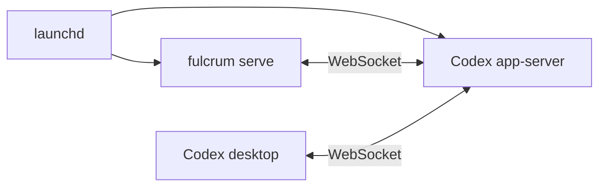

# Fulcrum: Python-Driven Runtime and Coordination

Fulcrum should spend model time on implementation, review, and useful decisions.
Its current agent-owned workflow also spends that time registering roles,
assembling handoffs, checking other tasks, and repeating operational context.
Python will own these mechanical operations while agents retain judgment.

The target is one local Python controller connected to the same Codex runtime as
the desktop. It creates and names tasks, supplies instructions, queues updates
until recipients are idle, and advances work from recorded outcomes. **Archon**,
the fleet scheduling decision maker, retains that authority. **Executor**, the
implementation agent, and **Overseer**, its independent reviewer, remain
separate conversations. Only one member of a pair may run at a time.

This is a target design, not a claim that the controller is implemented. It
supersedes the previous runtime-simplification proposal and conflicting runtime
ownership requirements in the older specifications. Writing this document does
not activate tasks or change the running fleet. Tollgate requires no changes.

## Related Information

These sources establish the existing behavior and the integration evidence.
Older role instructions describe the migration source, not additional duties
that agents must retain after Python takes ownership.

- [Desktop Python-control experiments](../codex-desktop-python-control.md):
  demonstrated shared-runtime creation, naming, model selection, messaging,
  status events, restoration, and archival, including timing and limitations.
- [Existing architecture](../technical-design.md): project boundaries, role
  purposes, shared memory, and the original execution-pair design.
- [Original requirements](../original-prompt.md): strategic coordination,
  independent review, and continuous workflow improvement.
- [Data contracts](../contracts.md): Beads intake, plans, identities,
  dependencies, and the agent-owned records being replaced.
- [Operations](../operations.md): existing delivery, recovery, and specialist
  responsibilities; this design replaces its scheduling and patrol mechanics.
- [Hooks](../hooks.md) and [validation evidence](../validation.md): implemented
  compaction refresh, bounded stop reminders, and narrow waiting-tool denial.
- [Setup](../setup.md), [readiness](../readiness-gate.md), and
  [compatibility](../compatibility.md): current installation and observations.
- [Dashboard](../dashboard.md): existing presentation and navigation; its
  readers must reflect the ownership and status defined here.
- [Review accounting](../../src/fulcrum/delivery.py) and [model
  policy](../../skills/fulcrum-shared/models.md): reusable review-count and
  bounded-replacement concepts, with ownership moved into Python.

## Responsibilities and Durable Authority

**Beads** is the issue tracker, and a **bead** is one issue. The **brain** is
the existing private repository containing plans, shared memory, and Beads
history. **Tollgate** manages source-worktree creation and cleanup, CI,
certification, promotion, and configured source synchronization. Fulcrum owns
the binding between an assignment, its worktree, and the permitted Executor.
A **candidate** is Tollgate's retained source submission; certification records
the checks passed by the reconstructed source it promotes.

A **task** here means a Codex desktop conversation with a runtime thread ID. An
**assignment** binds one approved bead and scope to an execution pair. A **run**
is an Archon-approved, ordered collection of related beads executed by that
pair. Different runs may proceed concurrently within configured limits.

**Weaver** interviews the user and authors tasks and plans. **Sage** assesses
workflow effectiveness. **Inquisitor** reviews whole-project architecture. Their
judgment remains model work while Python manages their operational lifecycle.

| Role | Judgment retained | Python-owned mechanics |
| --- | --- | --- |
| Archon | Priorities, capacity, exceptions | Proposals, dispatch, records |
| Weaver | Interview, scope, plans, beads | Registration, intake, archival |
| Executor | Implementation, checks, repairs | Handoffs, routine delivery |
| Overseer | Review, repair permission, exceptions | Routing, accounting |
| Sage | Workflow findings | Cadence, evidence, interviews, publication |
| Inquisitor | Architecture findings | Cadence, creation, publication |

The **controller** is the single Python process that owns operational mutations.
Run it as a per-user supervised service on the existing single Mac. Use a
process lock and SQLite transactions to prevent duplicate dispatch; configure
WAL, foreign keys, and durable commits. Do not hold transactions while waiting
for Codex, Tollgate, Git, or Beads.

- Beads remains the editable issue source of truth. Store approved scope
  snapshots and actual execution facts in SQLite, not another editable tracker.
- Python owns registrations, recorded scheduling approvals, reservations, outcome
  records, pending messages, recurring occurrences, and delivery obligations.
- Agents invoke narrow commands. They do not edit operational records, set their
  own completion flags, or write another role's state.
- Retain ordinary Git commit IDs for source and approved documents. Do not add
  content hashes, format versions, compatibility aliases, or parallel legacy
  record writers.
- Store concrete external-operation intent before sending a mutating request.
  Apply repeated events and command retries at most once locally.
- Keep output publication and remote synchronization separately observable.
  Failed synchronization retains an identified Python owner and retry action.

For example, a failed brain push must not rerun an otherwise successful Sage
analysis or create the same finding twice:

```text
Sage result retained; findings published locally
brain push failed; controller owns retry
Sage task archived after its turn and helpers finish
retry succeeds; existing findings remain unchanged
```

The existing Night Watchman task, patrol heartbeat, and agent-authored patrol
reports are removed. Python observes runtime state and due work directly. There
is no replacement monitoring agent. Remove Watchman from active role types,
registrations, setup/bootstrap inputs, CLI commands, hooks, installation,
readiness, and dashboard expectations. A healthy installation never requires a
Watchman task, automation, or successful patrol report.

Move any reused cadence or observation calculations from `watchman.py` into the
controller's scheduling/reconciliation modules, then delete `watchman.py`, its
skill, and obsolete patrol tests/fixtures. Do not retain a disabled role, alias,
or renamed patrol subsystem. Replace useful calculation tests with tests of the
controller operations. Historical records may remain in the inert cutover
export; current operational state contains no Watchman registration or duty.

## Shared Desktop Runtime

Fulcrum setup provisions one shared Codex app-server and the Fulcrum controller
as two separate per-user macOS `launchd` services. The controller and desktop
are clients of that same app-server. `fulcrum serve` connects to its configured
endpoint; it does not spawn a private server on connection failure.



### Service ownership and desktop connection

The app-server service runs this command with the configured installed Codex
binary and loopback endpoint (default port `4500`):

```sh
"$CODEX_BIN" app-server --listen ws://127.0.0.1:4500
```

The command runs the server; `launchd` supplies background operation and restart
on failure. Install separate LaunchAgent definitions for it and `fulcrum serve`,
using resolved executable paths and argument arrays. Retain the binary path,
endpoint, desktop executable, and service configuration outside resettable brain
state. Do not use shell backgrounding or a Python child-process supervisor.

The desktop must explicitly join the listener. The
[working topology experiment](../codex-desktop-python-control.md#working-listener-topology)
verified this launch on the inspected installation:

```sh
CODEX_APP_SERVER_WS_URL=ws://127.0.0.1:4500 \
  /Applications/ChatGPT.app/Contents/MacOS/ChatGPT
```

Setup provides a desktop launch wrapper carrying that environment variable and
the configured executable path. A variable in `.zshrc` does not configure an
already-running app or guarantee the environment of a Dock launch. If the desktop
is using a private runtime, report that it must be relaunched through the wrapper
after its existing work is drained. Do not silently terminate or migrate those
conversations. Verify this connection mechanism on the installed desktop build;
the experiment establishes observed behavior, not a permanent desktop contract.

Setup is repeatable: reuse the configured services and endpoint. A conflicting
listener requires explicit resolution; do not kill it, choose a different port,
or launch a second runtime implicitly. Check app-server readiness through
`/readyz`, then the protocol handshake. A successful health check proves the
listener is ready, not that the desktop shares it. Before enabling managed work,
verify both clients connect to the same listener and can observe the same test
thread ID/activity as in the experiment.

Restarting `fulcrum serve` leaves app-server and running Codex turns intact.
Restarting app-server is a separate explicit service operation or crash recovery;
it may affect unrelated desktop conversations. After either restart, the
controller reconciles retained activity before sending new work. Fulcrum fleet
reboots replace only its managed agents and preserve both service configurations.

### WebSocket adapter contract

Use the [official app-server protocol](https://learn.chatgpt.com/docs/app-server)
and the installed binary's generated schemas for concrete request/response types.
Keep the experimentally verified desktop connection behind the same small adapter.

- Use the app-server protocol behind a small adapter. Keep the endpoint local
  and preserve saved-project context, tools, permissions, and user history.
- Use a maintained WebSocket client library. The experiment's handwritten
  framing code proves feasibility; do not turn it into production networking
  infrastructure. Fulcrum implements only the required protocol methods and
  event handling, with schemas generated from the installed runtime.
- Verify the desktop and controller observe the same task IDs and activity.
  Sharing a data directory alone is insufficient.
- Use version-matched protocol schemas when implementing the adapter. Treat
  model selection, effective working directory, hooks, helper observation,
  interruption, and task control as independently verified capabilities.
- Persist returned thread and turn IDs. Titles help humans and recovery; titles
  never grant authority or replace runtime identities.
- Subscribe to runtime events and use targeted reads for reconciliation. Avoid
  routine scans through all archived conversations.
- Keep accepted requests, terminal turns, idle tasks, and completed assignments
  distinct. An accepted `turn/start` response is not a completed operation.

Each connection follows this sequence:

1. Connect to the configured WebSocket URL with the maintained client library.
   Send one `initialize` request identifying Fulcrum and its required capabilities,
   wait for its response, then send the `initialized` notification before other
   protocol calls. Repeat this handshake on each new connection.
2. Keep one reader receiving JSON-RPC responses, notifications, and server
   requests. Correlate responses with connection-local request IDs; use separate
   retained thread/turn IDs for lifecycle tracking. The wire protocol omits the
   `jsonrpc` field. A slow request must not stop event consumption.
3. Process supported server requests according to configured runtime approval/tool
   behavior and the installed schema. Unsupported requests receive an explicit
   protocol error and a surfaced capability condition; never silently approve
   them or leave them unanswered. Do not build a second interactive approval UI.
4. Reconcile retained active threads and unresolved operations through targeted
   reads, then enable eligible starts. Subscribe/resume relevant threads as
   required by the installed protocol so their events reach this client.
5. On disconnect, disable new starts and retain uncertain operations and capacity.
   Reconnect to the same endpoint with bounded backoff, initialize again, and
   reconcile before dispatch. Do not replay mutating requests just because their
   replies were lost; use the existing single-pass reconciliation rule.

| Fulcrum operation | App-server interface and required result |
| --- | --- |
| Check available models | `model/list`; validate configured models and reasoning settings |
| Create a managed thread | `thread/start` with explicit project working context/settings; retain returned thread ID before proceeding |
| Set canonical title | `thread/name/set`; verify `thread/name/updated` or targeted `thread/read` |
| Read runtime state/history | `thread/read`; use bounded `thread/loaded/list` or filtered `thread/list` only where discovery is required |
| Restore an archived thread | `thread/unarchive`, then `thread/resume` when loading is required; verify retained identity and readiness |
| Load an existing unloaded thread | `thread/resume`; re-establish event observation and confirm readiness before a turn |
| Configure role context | `thread/settings/update` where supported; apply effective model/effort, working directory, and permissions through the installed start/resume/turn schemas and verify results |
| Send an action brief | `turn/start` on the stored thread ID; retain returned native turn ID; acceptance does not complete the action |
| Observe work | `turn/started`, `turn/completed`, `thread/status/changed`, and relevant item/helper events; targeted reads resolve missing or reordered events |
| Interrupt authorized work | `turn/interrupt` with the stored thread/active native turn IDs; wait for actual termination and helper inactivity |
| Archive completed work | `thread/archive`; confirm `thread/archived` or a supported targeted read before marking archived |

Do not use `turn/steer` for ordinary fleet delivery: the idle-only rule uses a new
`turn/start` after prior work and helpers finish. Helpers remain native runtime
helpers; verify their parent linkage and terminal observations in the integration
harness rather than treating a parent's idle event as proof that helpers stopped.
Protocol IDs and parameters remain inside Python; finish commands need none.

### Runtime readiness

The experiment observed an idle notification before the corresponding turn
completion. Dispatch therefore needs corroborating state rather than a fixed
assumption about notification ordering:

```python
can_start = (
    last_turn_is_terminal
    and runtime_status == "idle"
    and helpers_are_terminal
    and no_unresolved_start_intent
)
```

An archived or `notLoaded` task must be restored or resumed as appropriate and
confirmed ready before receiving another turn. Missing or contradictory state
retains its reservation until reconciled. Silence alone is not a failure.

### Uncertain operations

A local transaction cannot make runtime creation atomic. Recovery must preserve
uncertainty instead of retrying an operation that might already have happened.

- Record creation intent, intended role/run, project, settings, and correlation
  information before sending the request. Prefer creation without a first turn.
- Persist the returned ID, set the canonical title, and register the task before
  starting model work. No model turn is needed to discover its own identity.
- On a lost response, make one automatic reconciliation pass through supported
  request evidence and targeted history. When the ID is unavailable, use at most
  one supported filtered discovery request; do not broaden filters or paginate
  through unrelated conversations to search for a match.
- Exactly one corroborated match can resolve an unknown creation. Multiple
  matches are an exception. An empty list or elapsed time does not prove the
  request was rejected.
- Record turn-start intent and exact delivered input before sending. Reconcile a
  lost response against that task's history before another send.
- Do not use a matching prompt alone as proof when identical prompts could
  legitimately occur; require the intended task, baseline turn history, and
  available operation correlation.
- If that pass cannot establish the result, hold the affected work, retain the
  operation and any reservation or message batch, and expose one operator-action
  condition in local status and the dashboard. Record that the pass was used so
  a restart does not repeat discovery. If disconnected, wait for reconnection
  before the pass; an unavailable endpoint is not evidence about the operation.
- The condition identifies the attempted operation, retained evidence, and what
  the operator must resolve: attach the actual task/turn or establish that the
  request did not take effect before permitting a retry. Use the explicit local
  admin path; do not wake agents to search or guess. Unrelated approved work may
  continue within remaining capacity and applicable holds.

```text
turn/start response lost
reservation and message batch remain unresolved
thread/read identifies the accepted turn after the retained baseline
controller attaches that turn; no second message is sent

otherwise: result still ambiguous after the bounded pass
controller retains the reservation and shows one operator action
restart preserves the hold; no broader search or duplicate send occurs
```

Endpoint failure disables new managed starts. The controller reconnects and
reconciles retained work; it does not fall back to agent-driven fleet tools.
Setup must expose capability failures clearly rather than claim unknown hook or
runtime behavior works.

## Setup, Identity, Names, and Models

### One-command installation

From a retained Fulcrum checkout on a new macOS environment, the supported entry
point is:

```sh
./scripts/setup
```

This command installs and configures the complete system, then waits for readiness.
It is a guided installer on first use, not a list of commands for the user to run.
Do not require a preinstalled Fulcrum CLI, manual virtualenv setup, hand-written
bootstrap JSON, copied thread/project IDs, a setup-agent conversation, or a
previously certified Fulcrum installation. The checkout is the permanent editable
runtime source. Record its actual Git revision without requiring the user to
supply a revision or manufacture a release ref before installation can begin.

Keep `scripts/setup` a thin shell bootstrap: locate/install the supported Python,
create or reuse the checkout's `.venv`, install `requirements-dev.lock` and the
editable package, then run that environment's `fulcrum setup` implementation.
Put configuration, dependency setup, enrollment, and readiness logic in existing
Python modules, shared with `doctor` and repeat invocations. Do not duplicate the
workflow in a large shell script or require manual activation of the virtualenv.

The first run collects missing user choices in the terminal and saves them as
ordinary installation configuration. Later runs reuse them. Discover installed
paths and native IDs through supported tools instead of asking the user for them.

| Setting | First-run behavior |
| --- | --- |
| Source, Python environment, Codex binary/desktop paths | Infer from the checkout and installed applications; install missing supported dependencies and verify their actual paths |
| Brain | Reuse configured state when present; otherwise ask whether to restore an existing brain or create a new one, and ask for the private remote destination; local path defaults to `~/brain` |
| State/config location | Use the existing `~/Library/Application Support/Fulcrum` default and explicit path/environment overrides |
| Projects | Select repository paths to enroll, offering the current checkout; infer existing native registrations and remotes; accept any selected set, without a fixed Fulcrum/Tollgate/Battlement requirement |
| Project validation command | Reuse existing Tollgate configuration or a known repository check entry point; ask when no unambiguous check command exists |
| Archon model and reasoning | Reuse the saved choice or ask explicitly from supported options; there is no implicit Archon model choice |
| Other models, endpoint, cadence, liveness checks | Use this plan's defaults unless overridden; establish cadence anchors from initial setup time |

For unattended setup, support the same entry point with an optional config file:
`./scripts/setup --config /absolute/setup.json --non-interactive`. Use the same
ordinary configuration fields, with no separate bootstrap schema or version.
Missing required choices produce one concrete error listing them. Secrets remain
in native credential stores; external account login or operating-system consent
may require the user. In interactive mode, open the supported login/consent flow
and continue after it completes; do not delegate the remaining setup to a checklist.

### What setup performs

Initial setup keeps ordinary execution dispatch disabled until the final
readiness check passes. The bootstrap Archon turn and disposable runtime check
are explicit setup actions; starting the services alone does not enable the fleet.

1. **Install dependencies and credentials.** Detect and install supported Python,
   Git, Codex desktop/bundled CLI, Beads/Dolt, and Tollgate through their supported
   installation paths, reusing existing valid installations. Verify Codex login
   and access to the selected private repositories. Implement concrete dependency
   installers and verify them on a clean development environment; do not leave
   “install prerequisites manually” as the normal product flow. If a dependency
   cannot be installed automatically on the selected environment, name that
   specific unsupported step and leave setup incomplete.
2. **Prepare the brain and local state.** Clone/restore the selected brain or
   create the requested new private brain and native Git/Beads remotes. Restore
   existing Beads history through native bootstrap; a Git clone alone is not a
   restored issue database. Initialize only genuinely new stores. Create the
   configured directories and let the controller initialize its SQLite state.
   Beads owns its Dolt server lifecycle; do not add a third Fulcrum supervisor.
3. **Install runtime assets.** Install the stable CLI link, retained human-entry
   skills, packaged prompts, and instruction-refresh hooks. Configure CLI discovery
   for both terminal use and managed agent shells; service/hook commands use
   absolute paths. Verify the actual loaded assets. Remove obsolete Fulcrum assets
   through the cutover rules; never install Watchman or deleted role skills.
4. **Start the shared runtime.** Install/start both LaunchAgents and create the
   desktop launch wrapper described above. On a fresh environment, launch the
   desktop against the shared listener. Verify login, handshake, and shared thread
   visibility. Existing active private-runtime conversations still require the
   documented drain/relaunch boundary; a rerun does not silently interrupt them.
5. **Enroll projects.** Resolve or create supported native Codex project and
   Tollgate registrations for the selected repositories. Configure the selected
   validation command and intended delivery/remote policy, then verify actual
   repository identity and integration health. Do not ask the user to copy native
   IDs or author readiness evidence. Unsupported native project-registration
   capabilities are a specific integration failure, not invented API calls.
6. **Create Archon and establish policies.** Create/name Archon with the selected
   model, or reuse the retained current binding on rerun. Deliver its initial
   setup brief with enrolled projects and human constraints. Wait for Archon to
   establish explicit capacity and recurring policies through its normal finish
   path. The installer observes the retained result; the user need not start a
   second setup conversation. Apply those policies before declaring readiness.
7. **Verify and finish.** Run the shared `doctor`/readiness checks against actual
   dependencies, brain Git/Beads connectivity and synchronization, projects, loaded
   assets, shared runtime, controller, and Archon policies. Include a disposable
   runtime create/name/turn/archive smoke check, without modifying product code
   or creating a real implementation bead. Exit zero only when the selected
   installation is ready to accept work. Print the Archon link, enrolled projects,
   and the usable CLI/desktop-launch commands.

Setup reports each stage and preserves completed work on failure. The same command
resumes by inspecting configured resources and retained operations; it does not
create duplicate remotes, registrations, services, or Archon threads. Use the
existing runtime uncertainty/recovery rules for ambiguous operations. Report
`setup incomplete` with the precise remaining action and exit nonzero, rather
than calling an installation ready with disabled selected projects. A rerun
neither wipes state nor replaces active agents; reset remains the explicit command
below. Existing legacy installations enter the drain-before-cutover flow through
this same entry point. `$fulcrum-setup` is an optional pointer to the script,
not a second installation workflow.

### Operate directly from the local Git clone

A retained local Git clone is required for both ordinary operation and development.
The checkout itself is the live runtime source, including uncommitted edits and
changes brought in by Git. Initial setup establishes dependencies, links, and
services once; editing source, prompts, skills, or hooks requires no install,
build, copy, publish, commit, or rerun of `scripts/setup` to take effect. Wheel-only
installs, copied runtime trees, and snapshots of the installed revision are not
supported. The recorded Git revision is diagnostic context, not an execution gate.

- Install the package editable in the checkout's `.venv`. The stable CLI link,
  hook directory, and retained skill directories resolve directly into that
  checkout. LaunchAgents invoke checkout-backed commands using that same Python
  environment. `doctor` verifies actual import paths and link targets, not merely
  that a command with the expected name exists on `PATH`.
- Each CLI/hook invocation reads the current source. Read prompt templates from
  the editable package's source directory whenever assembling an action brief;
  do not retain an in-memory template cache across edits or copy templates into
  installation state. Human skill instructions likewise come from the linked
  checkout when invoked. Existing agent turns retain the instructions already
  delivered; the next invocation, brief, or context refresh uses the edited text.
- An editable install alone does not reload imported Python in `fulcrum serve`.
  Include automatic source-change detection for `src/fulcrum/**/*.py` using a
  maintained file-watching library. Coalesce file-save events, then stop taking
  new mutations/dispatches, finish current short controller operations, and
  re-exec the controller from the same checkout at a safe boundary. Retain
  unresolved external operations for normal reconciliation; never repeat a
  mutation merely because code changed. Preserve the single-writer lock across
  replacement. This is a controller reload, not a fleet reboot: app-server,
  desktop, existing agent turns, thread IDs, and worktrees stay intact.
- Code reload happens automatically after the save and bounded current operation,
  without waiting for the 30-second scheduling fallback or for all agent work to
  finish. Resume requests and dispatch after reconnect/reconciliation. Surface
  import/startup errors through service diagnostics; do not silently keep running
  an old source snapshot. `launchd` remains the supervisor; do not add a third
  service, Python child-process supervisor, module-hot-swap framework, or content
  hashing scheme.

Dependency or package-metadata changes remain the explicit exception: changes to
`pyproject.toml` or `requirements-dev.lock` require reinstalling requirements and
the editable package in `.venv`, as required by this repository. Initial machine
setup and changing OS service registration are installation work; ordinary edits
to the linked runtime are not. Moving the checkout requires updating its links
and configured paths; do not silently operate from a detached copy.

### Setup authority and identity

Setup installs/starts the shared app-server and controller services, verifies the
desktop connection, enrolls projects, and establishes the current Archon binding.
It creates Archon through Python, using explicitly configured
model and reasoning effort. There is no default Archon model and no Watchman
creation step.

- Enrollment verifies the intended repository, saved Codex project, host, and
  existing Tollgate integration. Missing integration blocks that project's
  implementation dispatch, not unrelated observation or intake.
- Setup is repeatable: reuse its retained operation and actual Archon ID rather
  than create another Archon on every invocation.
- Archon's first useful turn establishes initial global/project limits and
  recurring policies. No execution starts until capacity limits exist; recurring
  runs additionally require their standing policy. An explicitly authorized
  one-off specialist run needs no recurring policy.
- Replacement transfers the binding after the previous Archon is inactive and
  pending decisions are reconciled. Reject later commands from the former
  binding; preserve previously approved scope and pending work except during
  the explicitly destructive reset defined below.
- Preserve Archon's configured model across replacement. Changes require user
  instruction. Use the normal explicit local setup/admin path, without adding
  biometric dialogs or a new authentication subsystem.

`$archon` runs the read-only `fulcrum archon` lookup and presents a link to the
current controller-owned conversation. It never converts the invoking task into
Archon or initiates a takeover. If no current Archon exists, return the setup
action instead of creating one implicitly. Setup and explicit reboot operations
own creation and replacement; Archon's instructions are packaged prompts too.

### Development reboot command

Provide `fulcrum reboot --soft`, `fulcrum reboot --hard`, and
`fulcrum reboot --reset` as mutually exclusive Python CLI modes. Each replaces
the fleet with fresh agent conversations; restarting only the controller while
resuming the same agents is insufficient. These are explicit local admin
actions and work without approval or cooperation from the current Archon.
Reuse controller lifecycle and runtime-adapter operations, with no reboot agent.
None of these modes restarts or stops the shared app-server or desktop process;
their unrelated conversations are outside the fleet reboot's scope. Reset also
preserves service definitions, connection settings, and the desktop launch wrapper.

| Mode | Stopping behavior | Retained state |
| --- | --- | --- |
| `--soft` | Stop new dispatch, let active turns and helpers finish, then retire the old agents | Brain, approvals, work, queues, policies, and obligations |
| `--hard` | Stop new dispatch, interrupt managed turns/helpers, and confirm termination before replacement | Same durable state as soft reboot, including unfinished source work |
| `--reset` | Stop agents as for hard reboot, dispose of owned pending external work, then wipe state and bootstrap | Source repositories and connection/model configuration only |

Soft reboot waits for current turns, not completion of every assignment or
multi-bead run. It does not silently become hard reboot after a timeout. Hard
reboot preserves worktrees, candidates, review history, and pending delivery;
fresh agents receive the relevant durable facts. Rebind pending work explicitly
to the new tasks. After verifying old-agent/helper inactivity and the worktree's
identity, Python may transfer the existing assignment and worktree to its fresh
Executor using the transfer checks below. Preserve unfinished changes in place.

Reset clears the selected environment's entire brain: plans, Beads issues and
history, reports, strategic and agent memory, and retained brain Git history.
It also clears controller records, task bindings, queues, approvals, holds,
reservations, recurring occurrences and policies, observations, logs, cached
prompts, and numbering. Remove old state exports rather than importing them into
the new system. Synchronize the reset brain through its configured remote paths
so prior state cannot return on the next pull or Beads synchronization. Reset
does not roll back promoted source commits or delete enrolled source repositories.

Before wiping ownership records, terminate managed helpers and owned processes,
reconcile or cancel pending Tollgate operations, and remove disposable owned
worktrees through supported interfaces. Reset explicitly discards pending tracked
and untracked work in those verified disposable trees before native removal;
soft and hard reboot preserve it. Never clean the primary source checkout.
Preserve the exact unresolved cleanup
if this fails and report reset incomplete; do not erase the only record of a
still-running operation. Retire old Codex conversations through supported
archival; their runtime-managed history is not imported into fresh agents.
These commands target the selected Fulcrum environment, not unrelated desktop
tasks or another environment's brain and resources.

Retain one in-progress reboot operation outside the paths reset clears so a CLI
retry or controller restart continues the same operation. Remove that temporary
record after completion. Apply the bounded uncertain-operation rule to runtime
calls. Bring up a fresh Archon with the retained model configuration; recreate
other roles only when work requires them. After reset, recheck configured
projects and require Archon to establish new policies before dispatch. Never
create Watchman. Return the new Archon link and any incomplete action.

### Canonical names

Python allocates names before managed work starts. Keep a separate persistent
increasing counter for each numbered role: `WVR`, `EXE`, `OVR`, `SAGE`, and `INQ`.
Each counter starts at 1, so `SAGE0001` and `INQ0001` can coexist. Creating a thread
advances only its role's counter. Each member of an Executor/Overseer pair receives
an allocation from its own role's counter; pairing does not require matching
numbers. Archon has no counter or allocation. Never recycle a number within its
role, including after archival or failed provisioning. The explicit `--reset`
wipe is the exception: each role's next allocation starts at 1. Soft and hard
reboot preserve all role counters; runtime task IDs distinguish old archived
conversations.

Archon's title is exactly `👑 ARCHON 👑`, with no description or number. Other
titles use `<emoji> [<ROLE><number>] <concise description>`, with uppercase role
codes `WVR`, `EXE`, `OVR`, `SAGE`, and `INQ`. Zero-pad the number to at least four
digits (`0001`, `0134`); values above `9999` expand without truncation or rollover.
Use exactly these emojis and spacing:

```text
👑 ARCHON 👑
🧵 [WVR0002] Simplify search indexing
⚒️ [EXE0134] Search indexing
🔎 [OVR0029] Search indexing
📖 [SAGE0017] Workflow postmortem
🛡️ [INQ0085] Fulcrum architecture
```

Runtime ID remains authoritative. Preserve the allocated number and role code
through compaction, restart, restore, and description changes. Python stores the pair
relationship explicitly; matching numbers or descriptions do not identify pairs.
Native subagents are helpers within a parent task and do not receive fleet numerals.

If a managed title changes unexpectedly, reconcile it to the retained role,
number, and approved description, or Archon's fixed title, on the next relevant
event. Do not perform a fleet-wide rename scan on every tick. Publish and verify the name before
reporting registration complete.

### Model policy

Weaver interprets model preferences conversationally, not through a strict
positional grammar or a Python parser for `$weaver` prompt text. With no model
specified, use Sol/high for both Executor and Overseer. A bare model preference
such as `$weaver luna` conventionally selects the Executor; named roles select
their own models. These choices do not change the current Weaver conversation's
model. For example, this is valid without reformulating it as flags:

```text
$weaver sol executor astra overseer: Please add flatbuffers
```

Weaver resolves that to Executor Sol/high and Overseer Astra/high. Accept natural
word order and ordinary prose; ask only when the intended role/model is materially
ambiguous or contradictory. Do not add a model call solely for parsing: this is
part of Weaver's existing authoring turn. Show the resolved choices with the
intake result without a separate confirmation when the user's intent is clear.

| Role or selection | Model | Reasoning effort |
| --- | --- | --- |
| Archon | Explicit setup configuration | Explicit setup configuration |
| Overseer, Sage, Inquisitor | `gpt-5.6-sol` | `high` |
| `$weaver` default Executor | `gpt-5.6-sol` | `high` |
| `$weaver luna` Executor | `gpt-5.6-luna` | `xhigh` |
| `$weaver sol` Executor | `gpt-5.6-sol` | `high` |
| Explicit Astra selection | `gpt-6-astra` | `high` unless otherwise requested |

Weaver passes resolved settings to Python through structured intake fields:
`executor_model`, `executor_reasoning_effort`, `overseer_model`, and
`overseer_reasoning_effort`. Store all four effective values on every resulting
bead, even when defaults apply, and snapshot them on assignment. Retain the
source of explicit human overrides with the bead. The example above itself
provides human authorization for the Overseer's Astra selection; no additional
permission exchange is required. Refinements update the same bead explicitly,
and changes to an active assignment follow the existing scope/model-change rules.

Python validates the resolved models and efforts against runtime capabilities;
it does not reject ordinary prompt wording. Unsupported settings block affected
dispatch and produce one actionable condition. Do not silently substitute models
or efforts. On each assignment, including when reusing a pair, apply and verify
both roles' retained settings before starting their turns.

Archon may explicitly change an Executor's model with rationale. Apply the
change at a turn boundary, retain earlier attempts, and preserve any stricter
human constraint. Existing policy requiring explicit human authority for Astra
continues. Python never upgrades a model solely because a counter reached a
threshold.

## Weaver Intake and Instruction Delivery

Weaver converts intent into concise tasks or a standalone plan with tasks. It
registers through a fast Python startup operation, receives the prompt needed
for its current mode, and performs its authoring work without fleet discovery or
a registration conversation.

Its mode-specific prompt preserves repository-first exploration, one-at-a-time
interview questions, and the distinction between small task intake and a
substantial standalone plan. Substantial plans retain the native cold-reader
and requirements-verifier helper passes; Weaver crafts those helper prompts.
Small tasks need neither a planning document nor those review passes.

The following are target Fulcrum interfaces, not existing commands promised by
the current installation:

```sh
fulcrum weaver register
fulcrum instructions
fulcrum intake --title "Fix empty search results" \
  --description "Show an empty-state message when search returns no matches; preserve matching results. Verify both cases."
fulcrum finish intake_complete
```

Writable registration establishes the thread's current authoring action; the
returned instructions contain the relevant intake and finish commands.

Registration binds the actual runtime identity, allocates the numeral once, sets
the canonical name, and returns the relevant instructions in one response. An
identical retry returns that registration. Naming/registration does not require
parsing model preferences first; writable authoring passes the resolved choices
at intake. Conflicting model selection after
publication needs an explicit update, not silent relabeling of existing work.

Weaver receives its canonical name and numeral on activation, including in Plan
Mode. Do not defer naming until publication. The controller performs the metadata
operation and retains the task/numeral binding; that binding creates no assignment,
publication permission, or finish obligation for a planning turn. Instruction
retrieval inside the turn remains read-only.

The [Plan-mode naming experiment](../codex-desktop-python-control.md#experiment-5-name-a-task-configured-for-plan-mode)
verified external `thread/name/set` against a task configured in Plan Mode. The
automatic `$weaver` activation trigger still needs a real desktop integration
check. Use that trigger to run the controller metadata operation; do not ask the
Plan-mode agent to bypass its restrictions or silently postpone the name if the
trigger is unavailable. Report that specific capability gap. Documents, beads,
and source changes still require the approved writable authoring phase.

- Small-task filing takes one `intake` command with a title and short description
  stating the intended change, bounded scope, and what counts as done. Do not
  require separate outcome/scope/acceptance fields, a Markdown plan, a JSON file,
  helper reviews, or an extra model turn to record an already-understood task.
  The author supplies meaningful content; Python checks required fields without
  invoking a model to expand or classify the description.
- Infer the project from the registered authoring context and carry forward
  both resolved role/model choices. Accept `--project` when the project is
  ambiguous; never guess among multiple projects. A human may also file directly with
  `fulcrum intake --project <project> --title <title>
  --description <description>` without creating a Weaver conversation. Direct
  filing is an explicit local CLI operation, grants no scheduling approval, and
  uses the same intake handler. Managed authoring uses its current thread/action binding;
  specialist findings retain their evidence-backed publication contract.
- The single-task CLI accepts `--executor-model`, `--executor-reasoning-effort`,
  `--overseer-model`, and `--overseer-reasoning-effort` for resolved preferences;
  graph intake carries the same fields per bead. Without preferences, both roles
  default to Sol/high. These structured interfaces are for Python validation and
  storage, not a syntax the human must use in a `$weaver` prompt.
- Optional `--depends-on <bead-id>` arguments and `--context <reference>` supply
  dependencies and supporting material. Use `intake --input tasks.json` for a
  substantial plan's complete task graph; both forms share validation and native
  publication code. Weaver is useful for clarification and substantial planning,
  not a mandatory extra conversation before filing a small task.
- Return the actual Beads ID and current publication/scheduling status after
  durable local filing. Do not wait for remote pushes, Archon acknowledgment,
  runtime task creation, or execution. Python retains ownership of remaining publication
  obligations and exposes failures in status; filing success is not dispatch
  readiness. Eligibility still enforces required publication and scope facts.
  Filing during an authoring turn does not end that turn; the existing finish
  command closes the author's work when done.
- All tasks, including tasks from plans and specialists, are pending by default.
  Only explicit future designation excludes them from scheduling proposals.
- Pending means eligible for Archon consideration. It does not approve work.
- Publish substantial plan documents and their task graph after authoring
  approval. Complete the graph before making its members dispatchable.
- Use stable intake identities and actual Beads IDs to reconcile retries,
  refinements, removed dependencies, and partial publication. Reject ambiguous
  duplicates, missing prerequisites, and dependency cycles.
- Retain approved plan commit and exact scope on assignment. A later document
  edit cannot silently change an active Executor's instructions.
- Commit/push Markdown and Beads history through their respective native paths.
  Preserve failed pushes as Python-owned obligations without repeating intake.
- A completed Weaver calls finish and ends. Python archives after retaining the
  outputs and assigning ownership of remaining publication work. Weaver never
  waits for Archon acknowledgment or archives itself directly.

A tiny task should remain tiny. Omitted model fields in this input are expanded
to both roles' effective defaults before storing the bead:

```json
{
  "project": "fulcrum",
  "title": "Correct the install example",
  "description": "Make the README installation example match the supported command. Verify it against the actual installation instructions.",
  "activation": "pending"
}
```

### Python-produced prompts

Python supplies canonical role instructions at task creation, a short notice for
each action, and a brief recovery reminder after compaction. Executor, Overseer, Sage,
and Inquisitor have no installed skills or direct skill activation path. Python
creates their tasks and supplies their instructions. Human-facing skills such
as Weaver and setup remain thin entry points.

Store action-specific text templates in `src/fulcrum/prompts/` as package data,
loaded afresh with `importlib.resources` from the editable checkout for each
brief. Use ordinary Python assembly; no new template
framework or model turn is needed to generate operational instructions. Dispatch
and compaction use separate renderers backed by current controller records.

Migrate the existing skill content by responsibility:

| Existing instructions | Destination |
| --- | --- |
| Executor implementation/validation and Overseer review criteria | Implementation, review, and repair prompt templates |
| Sage analysis, Inquisitor codebase coverage, finding quality, interview questions | Specialist action templates and authored results |
| Identity, handoffs, cadence, counters, publication, delivery, archival | Python operations; remove agent procedure text |
| Model constraints, escalation judgment, recovery decisions | Python enforces recorded policy; current prompts request only the needed judgment |

Move useful guidance out of `fulcrum-shared` into these destinations and remove
the shared skill-reading chain. Preserve substantive review and evidence
criteria without copying the old role's entire operational manual into every
prompt. Helpers continue to receive prompts crafted by their parent agent.

Separate three instruction surfaces:

- Creation supplies role purpose, judgment guidance, relevant boundaries, and how
  to retrieve context and finish an action. Do not repeat this manual in turn input.
- Each action notice is normally one to three sentences: what needs attention and
  what decision or result is requested. A missing-finish reminder requests only
  the outstanding result and never replaces the original action payload.
- Compaction supplies a brief role/action reminder and recovery references, normally
  50–100 words. Do not replay role instructions, action JSON, history, or schemas.
  Unrelated, retired, and actionless tasks (including planning Weaver) receive nothing.

`fulcrum instructions` retrieves current decision data and full approved scope.
`--section evidence` retrieves retained handoffs, diagnosis, reports, and interview
answers. `--section role` retrieves current role guidance; `--section finish` gives
complete commands with exact top-level JSON file examples and selection rules.
The default context view contains no operating manual or full command catalog.
Detailed reads must not silently truncate approved requirements. Short notices
must refer to this real read interface, not invented attachments. Scope and result
identity remain controller-bound; recovery does not depend on remembering a prior
message. Retain exact dispatched input for uncertain-operation reconciliation.

Correction context includes the original approval, allowed repair categories,
current findings, and retained delivery diagnosis. Evidence appears once in its
own view; older review findings are history, not automatically current requests.
Specialist context retains the requested project set and focus across continuation,
reports actual evidence intervals and sampling limits, and distinguishes captured
HEAD from certified source. Do not claim complete coverage from bounded samples.

Routine notice example:

```text
Two updates need your scheduling decision. Read `fulcrum instructions` for details,
then submit the appropriate finish outcome.
```

Archon receives compact proposals and exceptions. Python persists any briefing,
NEWS, or project-summary updates authored in Archon's result using existing
brain conventions. Preserve useful strategic memory without requiring Archon to
perform Git administration or rewrite unchanged summaries every turn.

Sage and Inquisitor prompts require concrete evidence for proposed tasks and
explicitly permit zero findings. Ask them to distinguish demonstrated problems
from speculative improvements using the publication rule below. Include this
instruction in their report-producing turns, without another skill-reading step.

## Scheduling, Capacity, and Holds

Archon is the final approver of task scheduling. Python performs eligibility
checks and proposes concrete work; it cannot infer approval from priority,
pending status, or an unanswered notification.

Approval records exact tasks, grouping, order, scope, and applicable conflicts.
Independent work may be separate runs even within the same project. Related
sequential work may share a pair. A run is project-scoped; cross-project task
dependencies are supported without moving a pair between projects.

```json
{
  "runs": [
    {"project": "fulcrum", "beads": ["fc-31", "fc-32"]},
    {"project": "battlement", "beads": ["bt-18"]}
  ],
  "global_limit": 4,
  "project_limits": {"fulcrum": 2, "battlement": 2}
}
```

Those numbers illustrate a decision, not hard-coded defaults. Approval binds
stored content; additions or material scope changes require a new decision.
Python may start approved work, route review and repairs, and resume bounded
recovery without another approval for each turn.

### Fast filing and dispatch

Separate durable filing, scheduling approval, and execution startup. Filing
records pending work immediately; it neither waits for approval nor creates a
new planning conversation. An approved run's next eligible action goes directly
through Python to dispatch, without another Archon decision or preparation turn.
New unapproved work normally needs one concise Archon decision before startup.

When Archon is idle and relevant execution capacity is available, deliver the
actionable scheduling brief immediately, including whatever updates are already
pending. Do not wait to collect a larger wave. Arrivals while Archon is busy
accumulate for its next useful brief, under the frozen-batch rules below.
The brief includes current usage and unfinished assignments, approved waiting
work, new proposals with their exact scope/dependencies, and the decisions needed.
Straightforward approvals should not require discovery calls or a conversation
with Weaver. Large evidence can remain linked; approval scope must be complete.

React to filing, approval, observed turn/helper completion, dependency changes,
and released capacity or holds. Re-evaluate affected work and advance eligible
approved actions promptly; do not place polling intervals or batching delays
between an approval and dispatch, between pair handoffs, or between sequential
approved tasks. These events do not themselves require an Archon turn. Preserve
the full-capacity suppression and explicit approval rules; speed does not grant
authority or bypass constraints.

Target subsecond local small-task filing and Python scheduling bookkeeping in a
healthy development environment. This is an implementation target, not a measured
claim or an end-to-end model-start guarantee. Measure command-to-durable-Beads-ID
latency and event-to-dispatch-request latency separately from Archon reasoning,
native worktree preparation, runtime task creation, and model startup. Report
external preparation time explicitly, rather than hiding it in a bookkeeping
measurement. Record timings in the existing disposable integration flow; no new
benchmark service, speculative prewarming, or pool of idle agents is required.

### Dispatch eligibility and ordering

Before every managed start, recheck activation, dependencies, unique ownership,
project health, holds, conflicts, capacity, and current approval. Prefer
Archon's recorded ordering. At equal priority, resume actionable started work
before starting another assignment; use readiness time and stable ID as
tie-breakers. New unapproved work cannot displace approved authority through
this algorithm.

A prerequisite is satisfied by actual required completion, not just an issue
marked closed. Code completion includes promotion, required source sync, owned
cleanup, and Beads closure. Cancellation does not satisfy a prerequisite unless
an approved scope change removes that dependency.

### Counting active work

A **slot** is a reservation for one managed parent-task turn and its native
helpers. Global and per-project limits count these reservations, not open
conversations or unfinished assignments.

Parents may compose helper prompts and use native spawn and
result-delivery tools. This is the exception to Python-produced role prompts and
fleet coordination, not permission to create another managed role or to replace
the Overseer's independent code review.

- Executor and Overseer alternate within a pair. Reserve capacity before
  dispatch; allow at most one active or uncertain start for the pair.
- Keep the reservation until the parent turn and its helpers are terminal. A
  parent waiting on its native helper still occupies its slot.
- Main roles do not use peer-task waiting tools. Native helper waiting and
  result delivery are an explicit exception, not a way to monitor another fleet
  role or substitute for Overseer review.
- Sage and Inquisitor consume execution slots. Fleet Sage consumes a global slot
  without a software-project slot; project-scoped Sage also consumes that project's
  capacity. Inquisitor consumes one global slot and one slot in each reviewed
  project, including for a one-off global review. Acquire these reservations
  together before dispatch. Interviews with execution roles consume their
  subject's global/project capacity as well.
- Archon and human-invoked Weaver turns are outside execution limits, including
  their native helpers. Track their activity for idle-only delivery nonetheless.
- CI waits, delivery retries, and inactive decision waits consume no model slot.
  Resumption must reacquire capacity. This policy does not bound the number of
  unfinished assignments; show that count separately.
- Unknown runtime activity retains capacity. Reconcile before replacing a task
  or claiming that its slot is available.

The user will not manually start a pair member while its partner is running.
Python guarantees exclusion for managed starts under that operating assumption.
Unexpected direct activity is a conflict to hold and reconcile, not evidence
that strict prevention of manual desktop starts has been implemented.

### Scoped pauses and conflicts

Archon may change limits at any time. Decreasing them prevents further starts
until usage falls below the new limits; it does not kill running work. A zero
limit deliberately disables starts in that scope.

- Ordinary pauses let active turns finish and retain their results. Block new
  review, repair, next-bead starts, and new delivery authorization under the
  hold.
- An explicitly urgent pause requests interruption, preserves work, and waits
  for observed termination. Do not equate interrupt acceptance with quietness.
- Scope changes hold the affected assignment, reconcile outstanding candidate
  authority, and require an approved replacement scope. Other runs continue.
- Holds compose: releasing one does not override another. Resume rechecks all
  constraints and retained work before dispatch.
- Archon can require a host/project quiet period or declare particular runs
  incompatible. Python acquires that exclusion before starting either run and
  keeps it through owned delivery/resource cleanup, including slot-free waits.
- A quiet machine requires observed relevant process and Tollgate drainage, not
  merely zero model turns. Do not stop unrelated user processes or treat missing
  measurements as proof of quietness.

```text
global limit changes from 4 to 2 while 4 turns run
all four may finish; no fifth turn starts
usage falls to 1; one eligible approved turn may start
```

Fulcrum does not implement general shared/exclusive resource keys or per-command
permits. Use explicit assignments and existing Tollgate resource admission for
ordinary work; use scoped holds for a quiet benchmark or known conflicting runs.

## Queued Updates and Idle-Only Delivery

Python translates outcomes and observations into useful recipient updates.
Agents report structured results; they do not compose routing messages to other
fleet tasks. A durable outgoing queue survives busy recipients and restarts.

- Retain updates by recipient and condition or assignment. Collapse successive
  status changes into the latest state while preserving unresolved decisions,
  findings, and distinct requested actions.
- Assemble one bounded batch when the recipient can use it. Do not send new task
  input while that recipient or its native helpers are active.
- Deliver useful updates immediately when Archon is idle and their actionability
  conditions hold. Batch updates already pending; do not add a timer to collect
  more arrivals. Busy recipients provide natural batching. Actionable pair
  handoffs likewise have no artificial delay.
- Urgent exceptions remain deliverable even when execution capacity is full,
  but still wait for an idle Archon. Apply required operational holds immediately
  in Python.
- Include concise action items, counts, and links to complete records. Never
  silently omit part of the scope Archon is being asked to approve.
- Suppress scheduling-only delivery when there is no eligible project/global
  capacity for pending work. When capacity or eligibility changes, re-evaluate
  once. Other actionable exceptions remain deliverable to idle Archon.
- Routine stage changes and individual completions update status without an
  Archon turn. Deliver completion summaries with another useful batch, or once
  at collection completion when a summary or decision is useful.

A message batch progresses through retained, sending, accepted, and processed
states. Acceptance means the runtime accepted a turn. Processing requires the
matching finish outcome to acknowledge the batch and record decisions or an
explicit deferral. Defer with a reason and relevant reactivation condition, not
an immediate identical wake.

```text
Archon is busy; three completions and two pending tasks accumulate
capacity is full; scheduling remains retained
capacity frees; Archon becomes idle
one batch contains current capacity, pending work, and completion summary
```

Freeze the delivered input and batch membership. Updates arriving during the
recipient's turn belong to the next pending batch. A reply cannot accidentally
acknowledge unseen updates. Validate decisions against current scope and holds;
stale decisions remain historical and return a concise conflict for resolution.

A lost send response leaves the batch unresolved until runtime reconciliation.
Apply the single-pass and operator-resolution rule above; never resend solely
because the agent has not acknowledged it yet. If its confirmed turn ends
without a required outcome, use the controller-owned missing-outcome policy. The same
unchanged exception does not create repeated Archon wakes.

## Finish Commands and Lifecycle Hooks

`fulcrum finish` records the outcome of a managed action and tells the agent to
end its turn. Python uses that explicit result to advance the work after the
thread and its helpers stop. Routine commands need no identity arguments:

```sh
fulcrum finish ready_for_review --evidence path/to/validation.md
fulcrum finish approved --assessment "Matches the approved scope"
fulcrum finish blocked --reason "Required test service is unavailable"
```

These are alternative outcomes. The agent supplies judgment and evidence;
Python supplies the workflow context. Substantial findings, scheduling decisions,
and reports may use `--input <file.json>` as specified in the outcome table below.
Routine outcomes require no intermediate file.

### Bind to the thread's current action

The CLI reads `CODEX_THREAD_ID` from its environment. Python looks up that
registered thread's current assigned action and checks that the outcome is valid
for it. For example, `approved` must belong to an assigned review. Reject missing
identity, a retired thread binding, no assigned action, or an incompatible outcome
with a concrete error. Agents do not supply a role, thread ID, turn ID, or
`--dispatch` token to finish.

Python already allows one managed turn at a time per thread and controls when
its assignment changes. Keep that assignment until the action is resolved and
the thread and helpers are inactive. The runtime adapter retains native turn IDs
returned by the runtime for completion-event correlation and lost-response
reconciliation. Neither agents nor hooks derive turn IDs, and CLI outcome
validation needs no agent-facing turn identifier.

This assumes agents invoke finish in their assigned turn. Detached processes
submitting finish later are unsupported. A compatible command pasted into a
later action on the same thread cannot always be recognized as stale; accept
that limitation instead of adding command tokens or transcript analysis.

Bind approval to the exact candidate attached to the assigned review. Bind an
Executor's result to its retained submission receipt, and `intake_complete` to
the current authoring action's retained intake. An interview answer belongs to
the assigned interview, never the subject's old implementation work. Do not infer
review approval from the worktree's latest contents or from an agent's final prose.
An identical finish repeated for the same action returns the retained result;
a conflicting result is rejected. Do not replace an already accepted outcome.

### Advance after completion

Before advancing, Python checks that:

- The current action has a valid recorded outcome.
- Its runtime turn completed normally and the thread and helpers are inactive.
- A candidate outcome refers to the assignment's expected immutable candidate
  and recorded source OID.
- Current approval and holds permit the next action. Native delivery checks
  still apply at the delivery boundary.

Unknown runtime or candidate facts wait for targeted reconciliation. A failed
or interrupted turn, or contradictory candidate evidence, retains the action,
result, and work for recovery. Resolve the concrete failure and issue a specific
recovery action when needed; do not implement a generic corrected-outcome or
supersession protocol. Existing bounded operational recovery remains applicable.
Later worktree edits do not change an immutable submitted candidate. Do not scan
later tool calls or final prose for possible report invalidation.

### Missing outcomes and instruction hooks

Python alone handles missing finish. When a managed turn ends normally without
an outcome, wait for the thread and helpers to be idle, then request the completion
report once under normal capacity and hold checks. The reminder includes the
current action, retained evidence, and allowed finish commands; it does not ask
the agent to repeat its implementation or analysis. Store one `reminder_sent`
flag on that action before sending. The reminder continues the same action and
cannot reset that flag; restart and duplicate events cannot create more reminders.
Uncertain reminder delivery uses the existing runtime reconciliation rule.

If the reminder ends without a valid outcome, retain the work and queue one
Archon exception. Failed or interrupted turns use the explicit recovery path
above. Do not infer success from prose or automatically repeat recovery turns.
Unrelated threads and Plan-mode authoring have no finish obligation or reminder.
Writable Weaver authoring has a current action; Plan-mode naming alone does not
create one.

Startup and `SessionStart` compaction hooks only restore the current role/action
instructions from local controller facts. They do not enforce finish at stop,
send reminders, or maintain correction counters. Keep these reads comfortably
within the two-second hook ceiling; an unavailable controller produces a clear
context diagnostic rather than a fleet scan or a second state writer.

Packaged prompts explain coordination boundaries and the native-helper
exception. Defer tool-blocking guards unless observed mistakes demonstrate their
need; do not build a shell-command parser or a general bypass-prevention layer.

### Archive completed threads

Python automatically archives a managed thread when its role's work is complete
and no further action is assigned to that thread. Agents end their turns after
finish; they never archive themselves or wait for Archon to acknowledge completion.
Archival is a controller operation requiring no model turn or execution slot.

| Thread | When Python archives it |
| --- | --- |
| Weaver | Its writable authoring work has a successful final outcome and retained outputs; remaining publication/sync work has a durable Python owner |
| Executor and Overseer | Their approved run has no remaining beads, and the last assignment meets the full delivery/cleanup/closure contract; archive both threads |
| Sage and Inquisitor, recurring or one-off | Their final report and explicit findings list are retained, no analysis/interview continuation remains, and remaining publication/sync work has a durable Python owner |
| Restored interview subject | Its interview action is resolved and it is inactive, if Python restored it from archived state; otherwise preserve its prior active lifecycle |
| Current Archon | Keep open between decisions; archive only when explicitly retired or replaced, including reboot |

For all rows, wait for observed thread and helper inactivity before invoking
the runtime's supported archive operation. A valid finish is not permission to
archive a still-running thread. Use the stored runtime thread ID; never look up
an archive target by title. Retain thread IDs, role records, outcomes, and links
after archival so status and later authorized interviews can find the history.

An Executor handoff, Overseer approval, CI wait, pause, blocker, or Sage request
for interview evidence does not complete the thread's work. Keep the pair for
remaining approved sequential beads, even if the next bead is temporarily
blocked. Archive it when the run ends; do not retain it for hypothetical future
work. Failed or interrupted actions remain available for their concrete recovery.
Explicit cancellation or retirement may end that lifecycle after preserving
work and resolving or transferring owned obligations under the existing rules.
Plan-mode Weaver naming alone never triggers automatic archival.

Record archive intent with the thread's lifecycle completion using the existing
external-operation record, and process it promptly once inactivity and cleanup
requirements hold. Re-evaluate it when helpers stop or required cleanup finishes.
On restart, resume retained
archive work; no fleet scan, archive daemon, or separate retry framework is needed.
Mark the thread archived only after runtime confirmation. A failed or uncertain
archive leaves completed work completed and exposes `archive pending` with the
specific failure in status. Reconcile through the existing bounded runtime policy
before retrying an ambiguous operation. Do not silently drop the obligation or
rerun the agent's work. Track each pair member separately so one successful
archive is retained if the other's operation fails.

## Pair Execution, Review, and Delivery

Python starts Executor directly with Archon-approved scope. There is no routine
Overseer assignment-preparation turn. Each bead has one active assignment and
one owned source worktree; sequential beads in a run use fresh worktrees.

Python invokes `tg --repository <id> worktree create <name>` and retains the
returned path, branch, and base. Fulcrum records the assignment's Executor binding
separately; Tollgate's worktree interface does not require a Codex task identity.
Do not invent a native owner field, task impersonation, or a Tollgate transfer
API. Configure the Executor to use that worktree rather than creating an
independent Codex worktree. Verify native creation, submission, and cleanup
through the real integration before enabling dispatch.

A fresh Executor may resume the same assignment's worktree after an explicit
soft/hard reboot or approved replacement. Python first confirms the old Executor
and helpers have stopped, verifies the registered Git worktree's repository,
path, branch, and current HEAD, and inventories pending changes, owned processes,
and native candidates. Unknown activity or mismatched identity holds the transfer.
Then update the Fulcrum Executor binding atomically, reject commands from the old
binding, and supply the fresh agent with a complete recovery brief and verified
working directory. Preserve dirty files, assignment scope, review history, and
delivery obligations. Transfer does not grant new promotion authority or make
uncommitted changes part of an immutable candidate. New beads still get fresh
worktrees; changing agents within the same assignment does not require one.

- Executor investigates, implements, and runs proportionate local validation. It
  supplies relevant rendered evidence for UI changes and tracks owned demo or
  background processes that require cleanup.
- Python helpers submit the immutable candidate without promotion authority and
  retain its actual identities and evidence. Existing speculative CI may proceed
  without a model waiting for it.
- Executor records ready-for-review and ends. After confirmed inactivity, Python
  schedules Overseer with the exact scope, source, and evidence.
- Overseer independently inspects actual source and surrounding code read-only.
  It neither edits the Executor worktree nor runs another build pipeline there.
- Overseer records a review outcome and ends. Python validates the result and
  routes a correction or advances delivery after confirmed inactivity.

The principal stages describe expected work; holds and unresolved obligations
are separate so pausing does not erase progress:

```text
queued, preparing, implementing, review_pending, reviewing,
correcting, delivering, recovering, completed, canceled
```

An escalation can occur at any stage without losing its source, candidate,
review history, or next responsible action. Overseer handles in-scope judgment
calls; Archon handles scheduling, scope, model changes, and unresolved
escalations. Neither starts a turn merely to relay an unchanged status report.

### Review authority and bounded repairs

A **mandate** is Overseer's retained approval of the assignment scope and exact
candidate, including any expressly permitted replacement categories. It is
Fulcrum approval evidence; it is not a new Tollgate certification mechanism.

- Review outcomes are approved, changes requested, or incomplete. Approval
  requires an explicit scope assessment and no unresolved blocking findings.
- Findings identify incorrect behavior, evidence, and a requested correction.
  Preserve stable finding references within a review cycle.
- Count each newly assessed source once. Missing evidence, duplicate reports,
  transient infrastructure failures, and repeated candidate observations do not
  increment unsuccessful substantive reviews.
- After three unsuccessful substantive reviews, pause further correction and
  retain an Archon exception. Archon chooses the next bounded approach without
  erasing prior attempts. There is no automatic model upgrade or promotion.
- Repair permissions may cover ordinary merge-conflict resolution and bounded
  in-scope CI fixes. Permissions must be explicit; absence means review again.
- A covered replacement retains its new source/candidate, original approval,
  predecessor, repair reason, and validation. Executor classifies its own repair
  against Overseer's explicit permissions and reports `repair_category` plus
  `repair_rationale` explaining why the concrete changes qualify.
- Python checks the registered Executor, current assignment, predecessor and
  replacement candidate/source identities, presence of the rationale and
  validation, and membership of the reported category in the retained approval's
  allowed repairs. It does not assess the rationale's semantic correctness or
  classify the diff. This workflow trusts Executor's repair-scope judgment.
- Executor must request Overseer review when uncertain or outside the granted
  permissions. A report without matching permission cannot advance as a covered
  replacement. Clearly covered repairs require no additional Overseer turn;
  every replacement still requires native certification.
- A source change outside the mandate or an approved scope change requires a new
  review. New source still requires Tollgate certification in every case.

Adapt the existing `authorize_replacement` helper to this ownership: its current
contract assumes Overseer has classified the concrete repair. In the controller
workflow, Overseer grants the categories, Executor classifies the repair, and
Python records the permitted replacement after the mechanical checks above.

```sh
fulcrum finish approved --assessment "Matches the approved indexing task" \
  --allow-repair ordinary_merge_conflict --allow-repair bounded_in_scope_ci_fix
```

Source immutability, registered caller, current assignment, and explicit review
outcome are validated in Fulcrum. Do not introduce a verifier child process,
biometric override, or Tollgate review-enforcement policy. Normal local tools
remain outside a hostile-agent security boundary; this design does not claim
that every direct Tollgate invocation is made impossible.

### Python-owned delivery

Python performs routine delivery after review, using existing Tollgate status,
authorization, diagnosis, push, and cleanup interfaces. No agent remains
active to observe CI or retry an ordinary network failure.

- Recheck candidate/source, scope, mandate, inactivity, and holds before new
  authorization. If a native authorization also covers pending dependencies,
  inspect that set and require appropriate authority for each affected item.
  Refuse uncertain coverage rather than authorize extra work implicitly.
- Continue existing speculative CI instead of launching duplicate validation.
  Read native certification and promotion results, not inferred success flags.
- On CI failure, obtain retained native diagnosis and logs and resume Executor
  to diagnose and fix the cause within its scope and applicable mandate. Flaky
  tests and CI defects require repair; Fulcrum never automatically reruns the
  unchanged candidate hoping for a pass. A repair outside the assignment's scope
  goes to Archon for a scoped repair task, with the affected delivery retained.
- Use `tg diagnose` in its retained-evidence mode; do not automatically request
  diagnostic replays. Executor may run targeted experiments to investigate a
  failure, but a later green run alone does not resolve the original defect.
  Revalidation follows a concrete source, test, CI, or environment repair. Python
  must not classify arbitrary logs as transient or maintain another CI-retry
  counter. Native certification remains required after repair.
- Bound transient connection and synchronization retries with backoff; after
  repeated failure retain one exception and retry observation at low frequency.
  Reconcile uncertain mutations before retry regardless of elapsed time.
- Preserve promoted-but-unsynchronized work as delivery recovery. Never create
  another implementation assignment merely to push or clean up existing work.
- Verify configured source synchronization, owned process termination, and
  supported worktree/branch cleanup before Beads closure. Keep brain-history
  pushes as separately owned obligations.
- At run completion, archive both pair members under the archive rules above.
  Keep them for the next approved bead when the run still has work.

The inspected Tollgate implementation treats failed checks as terminal failures.
Its separate service-error and interrupted-run recovery can automatically
restart execution. Fulcrum neither adds another retry layer nor claims to disable
that native behavior. Changing Tollgate's own interruption recovery is separate
from this controller plan. Connection and push retries above do not rerun CI.

An assignment is complete only when required review or covered replacement
approval, certification, promotion, source synchronization, owned cleanup, and
Beads closure are observed. A run proceeds to its next bead only then.

Tollgate may already have accepted authorization when a pause arrives. Use its
existing cancellation or suspension capability where available and report the
observed disposition. A local hold cannot guarantee revocation of an accepted
operation or undo promotion. If a required stop cannot be established through
existing interfaces, hold further work and expose the limitation; do not require
a Tollgate change or silently claim safe revocation.

When reusing the pair, confirm the previous bead's cleanup and bind both roles
to the new assignment. Update Executor's effective worktree and permissions
through supported runtime configuration and verify its Git root before edits. If
the runtime cannot safely change that context, hold the run as an integration
failure rather than continue in the previous worktree. Overseer receives the new
scope independently of Executor's narrative; earlier mandates do not apply.

## Specialists and Single-Round Interviews

### One-off runs

Provide these Python entry points; they create managed specialist tasks using
the same packaged prompts and controller lifecycle as scheduled occurrences:

```sh
fulcrum sage
fulcrum sage --scope "Investigate why recent review handoffs have been slow"
fulcrum inquisitor
fulcrum inquisitor --project fulcrum --scope "Review the indexing architecture"
```

Both commands accept optional `--project <id>` and `--scope <prompt>`. Without a
project, Sage assesses fleet workflow and Inquisitor reviews all currently enabled
projects. With a project, either role is limited to that project. A scope prompt
focuses the role's analysis; without it, use its normal broad workflow or
architecture review. Resolve the project set when accepting the request and
retain it with the exact prompt; later project enrollment does not expand it.
Python uses the project selector to bind scope and capacity, rather than trying
to infer a project list from arbitrary prose.

A direct human CLI request authorizes that one analysis run. Return a retained
request ID and queued/running status promptly, without waiting for Archon,
analysis, or publication. Archon may also request a one-off run in its structured
decisions. Other agents can propose a run for Archon's approval; they cannot
grant themselves this authority. A one-off request does not require a new Bead,
installed specialist skill, or standing recurring policy.

Queue the request under existing priorities, limits, holds, and project health
checks; it does not interrupt active work or bypass capacity. Start a fresh
numbered specialist thread when eligible. A global Inquisitor uses one thread
with the retained project set and each project's recorded certified source
commit; reserve capacity in each reviewed project as described above. Show
specific blockers in status. No matching project means an actionable request
error, not a successful empty architecture review.

Reuse the occurrence, report, findings, interview, and publication paths below.
Store the trigger as one-off with its authority, project set, and optional scope;
it has no cadence anchor. Restart resumes that same request. Each explicit new
invocation requests a new analysis; transport retries of a retained request reuse
its identity. One-off runs neither advance nor reset recurring due times and
do not replace an already queued recurring occurrence. Findings still require
concrete evidence and Archon approval before implementation; zero findings is
valid. Reports and completion status remain accessible by request ID after the
specialist is archived.

### Recurring runs and shared reporting

Archon approves standing recurring policies. Python tracks due times, creates
occurrences, and dispatches them under those policies without seeking approval
for each daily occurrence. Archon may revise or suspend the policies.

Default cadence is one fleet Sage run every 24 hours and one Inquisitor run per
enabled project every 24 hours, offset twelve hours from the Sage anchor.
Preserve configured anchors across restart.

- Maintain one unfinished occurrence per job. After downtime, create one
  catch-up occurrence, not one per missed day.
- On completion or explicit skip, advance to the first future cadence point.
  Failed analysis or publication stays attached to the same occurrence.
- Apply holds, limits, project eligibility, and Archon's priorities. Policy
  approval does not exempt specialists from capacity or conflict checks.
- Sage reads workflow events, outcomes, failures, and retained evidence. Recurring
  Inquisitor examines the whole project at a recorded certified source commit;
  recent changes receive no privileged review scope. One-off runs follow their
  retained project set and optional scope prompt using the same evidence rules.
- Findings include the problem, evidence, expected benefit, affected project,
  and acceptance criteria. Deduplicate against existing issues using stable
  problem identity and explicit reconciliation, not another generated hash.
- Specialists may propose tasks only for demonstrated defects, observed workflow
  friction, or specific unmet requirements. Concrete code-level evidence is
  sufficient; neither a production incident nor a numerical measurement is
  required. Hypothetical scaling concerns, possible future abstractions, and
  other speculative improvements remain observations in the report and create
  no beads, including future beads.
- The specialist judges whether its evidence demonstrates a problem. Python
  requires nonempty problem and evidence fields for submitted findings and
  publishes that explicit list; it does not classify prose, extract tasks from
  report observations, or invoke an additional evidence-review agent.
- Publish those findings as pending unless explicitly deferred. Archon still
  approves execution. Findings default to Sol/high for both Executor and Overseer
  unless their approved policy or one-off request selects other supported models;
  persist both effective role settings on resulting beads under the model policy
  above and permit normal Archon revision.
- Retain reports, including explicit empty findings. Publication retries reuse
  the report and occurrence without repeating model analysis.

### Interviews

Sage first uses retained evidence, then may request one consolidated interview
per selected task per postmortem. There is no follow-up questioning round.

```text
Sage records requests for EXE0134 and OVR0029, then ends
Python queues each interview until eligible and available
subjects answer once through finish; Python restores prior archival state
Sage resumes once with answers and explicitly missing responses
```

Python retains subject identity, prior archival state, request, due time, and
answer status. Default collection timeout is 24 hours from the request, and the
standing policy or authorized one-off request may override it. This prevents an
unavailable subject from holding an occurrence forever without treating silence
as an answer.

- Do not interrupt active work for interviews. Obey pair exclusion and normal
  subject capacity; an interview does not authorize old code work.
- Restore archived subjects only when ready to interview. Rearchive only
  subjects Python restored, after their answer turn and helpers finish.
- Distinguish interview-only outcomes and instruction context from implementation work.
- Resume Sage when all requests are resolved or the collection deadline passes.
  Report absent answers as missing evidence, without reminders to the subject or
  another interview round. Late answers are retained without reopening the
  completed postmortem automatically.
- At the deadline, expire interview requests that have not started and remove
  their pending delivery. They must not wake subjects later. Reconcile an
  uncertain start before classifying it as expired. Already-running interviews
  may finish; retain their late answers and restore prior archival state without
  interrupting them merely because collection closed.
- An interrupted interview retains its evidence for specific recovery; it is
  not permission for new questions. A normally ended interview missing its
  answer uses the controller's one missing-outcome reminder.

Specialists require no source worktree or fabricated promotion candidate for a
read-only report. Python archives them under the shared completion rules after
their final report, including a report with zero findings. A retained
`evidence_needed` result keeps the specialist available for its continuation.

## Recovery and Status

Python compares expected workflow state with actual runtime and native delivery
facts. It should explain a concrete invalid state, not assign another agent to
ask whether work is still happening.

### Events, timers, and fallback reconciliation

The controller replaces Watchman's mechanical checks with three triggers into
the same scheduling/recovery functions:

- Relevant events immediately re-evaluate affected work: intake, decisions,
  turn/helper completion, native delivery results, and changes to holds or capacity.
- Timers handle known due work: recurring specialists, interview deadlines,
  scheduled rechecks, and pending Python operations eligible for another attempt.
- A fallback reconciliation pass runs every 30 seconds in the existing controller
  loop. It catches missed events and retained work that has not advanced. Normal
  dispatch never waits for this interval.

On each fallback pass, refresh queued Beads and relevant dependency facts through
project-scoped native reads, inspect unfinished controller actions and operations,
and refresh runtime status for managed threads/helpers whose activity needs
confirmation. Check eligible queued work even when no agent is running. Include
due publication, delivery, and archive obligations. Do not scan archived thread
history, reread source repositories, or wake a model to perform these checks.
An ambiguous operation that exhausted its reconciliation pass remains an operator
condition; the timer does not grant another attempt or repeat discovery.

Use one in-flight pass. Slow native reads run off the event loop with adapter
timeouts; a late pass does not create overlapping or catch-up passes. Failed reads
leave the affected facts unknown and visible while unrelated work can proceed.
After restart or reconnection, reconcile retained work before resuming affected
starts. Repeated events and fallback observations use the same retained action
and operation identities, so they cannot duplicate starts, reports, or archives.

When capacity is idle, apply these ordinary scheduling rules:

| Current facts | Controller action |
| --- | --- |
| Approved work is eligible | Dispatch it directly |
| Unapproved work is eligible, relevant capacity is available, and Archon is idle | Deliver one current scheduling brief immediately |
| Archon is busy | Retain the brief for idle delivery |
| Work is blocked | Expose its specific dependency, hold, capacity, approval, integration, or unresolved-operation reason; reconsider on relevant changes |
| No eligible work or actionable exception exists | Remain idle; do not manufacture an agent turn |

### Suspected stalls and known failures

For controller-started agent turns, schedule one liveness inspection after
30 minutes by default. Make this duration a simple setup setting,
`turn_check_after_seconds` (default `1800`); Archon can set a later check time for
an identified long-running action. This is an inspection threshold, not a timeout
that interrupts or replaces the agent. Human-driven Weaver conversations and
Plan-mode authoring do not receive automatic long-turn alerts.

At the due time, read the specific thread and its native helpers. Retain the
assigned action, elapsed time, last observed runtime event, current tool/helper
activity when available, and any explicit runtime failure. A parent that stopped
while helpers remain active still needs this inspection. Do not reset the check
merely because token or tool events keep arriving; activity does not prove useful
progress. Native CI and other Python-owned waits use their own operation status
and deadlines, not the agent-turn threshold.

| Observation | Response |
| --- | --- |
| Turn completed normally without an outcome | Use the one missing-outcome reminder after helpers stop |
| Turn failed or was interrupted | Retain work/evidence and use specific recovery; no blind repeat of the work |
| Agent reported a blocker | Route the concrete decision to its responsible role |
| Inspection confirms completion but the completion event was missed | Process that completion through the normal lifecycle |
| Thread or helper remains active past its check time | Retain one possible-stall condition and notify Archon with the observed evidence; keep its reservation |
| Runtime cannot establish activity | Retain uncertainty and expose the connection/capability condition; do not claim the agent is dead |

Archon may decide to continue waiting with an explicit next check time, request
interruption, or approve replacement. The same unresolved condition updates
status without repeated Archon wakes; an explicit deferred check reactivates that
condition when due. Completion clears it. Replacement still requires confirmed
termination and the worktree-transfer checks. Neither elapsed silence nor a
stream of repetitive activity authorizes automatic replacement. Python does not
score transcripts or judge whether implementation is making semantic progress;
Overseer review and Archon judgment cover that question.

If the affected thread is Archon, expose one operator-attention condition instead
of sending an exception to that same busy or unavailable thread. The service
supervisor restarts a crashed controller; this does not claim to detect every
live-but-hung process. Use the explicit reboot commands for operator recovery.

### Recovery boundaries and status

- Reconcile startup state, connection recovery, terminal events, unexpected
  archival, failed turns, missing outcomes, and overdue concrete obligations.
- Retain uncertain ownership and capacity until actual inactivity is known.
  Inventory worktree, candidate, and processes before any approved replacement.
- Never adopt another Executor's worktree implicitly. Authorized replacement
  uses the Fulcrum binding transfer and worktree checks above; no native
  task-ownership transfer or reconstruction into a new tree is required.
- Reconcile interrupted operations before retry. Retain the same operation ID,
  expected inputs, observed result, and next action across controller restarts.
- Ambiguous runtime requests use the single automatic reconciliation pass above.
  An exhausted pass remains held for operator resolution across restarts;
  periodic recovery must not reopen discovery or turn it into an Archon loop.
- A controller crash cannot create a second scheduler: the process lock and
  reconciliation gate precede dispatch after service restart.

If Archon itself exhausts finish recovery or becomes unavailable, retain its
pending decisions and show one operator-attention condition in local status and
the dashboard. Do not escalate endlessly back to the same broken task or give
another role scheduling authority. Previously approved work may continue where
safe; new approvals wait for explicit recovery or setup replacement.

Read-only status exposes the shared controller read model:

```sh
fulcrum status --run run-3 --events 20
fulcrum status --queue
fulcrum status --capabilities
```

Expose role/title/ID, project, current bead, stage, runtime activity, helpers,
slot usage, unfinished-work count, holds, pending decisions, last observation,
review/source identities, remaining delivery obligations, the last completed
reconciliation pass, and each suspected stall's evidence and next check. Explain why a
queued run cannot start. Missing observations are unavailable, never zero or
complete. Task links must open the actual desktop context.

This checkout has a dashboard design document, not an implemented dashboard.
Provide the machine-readable `fulcrum status --json` views and update the
dashboard contract to consume them. Building the dashboard UI is separate work;
do not create a new web service or pretend to migrate nonexistent readers as
part of the controller implementation.

### Operational diagnostics

Retain concise controller events needed to explain current status and failures:
what action started or finished, why work is waiting, and which Python operation
owns remaining recovery, publication, or archival. Link to existing runtime and
Tollgate evidence rather than duplicating tool transcripts or CI logs.

This is ordinary workflow diagnostics. There is no cost audit, required token
accounting, comparison against historical workflow costs, or recurring efficiency
report. Sage can investigate concrete workflow friction using retained events and
outcomes without requiring a cost-measurement pipeline.

Keep the filing and dispatch timing checks specified above in the development
integration flow to verify responsiveness. They do not require an ongoing audit
or a new benchmark service.

## Drain-Before-Cutover Migration

There must be one owner of dispatch. Transition only after the old scheduler
stops assigning new work and existing runs and delivery obligations finish or
are explicitly resolved by an operator.

- Inventory active roles, worktrees, candidates, holds, interviews, publication,
  source pushes, cleanup, and recurring occurrences before changing ownership.
- Do not automatically adopt active conversations or incomplete candidates into
  the new controller. Unresolved work blocks cutover; do not discard it to make
  the inventory appear clean.
- Preserve projects, plans, Beads identities/dependencies, model constraints,
  strategic memory, cadence anchors, and historical review/delivery evidence.
- Initialize each role's counter above that role's historical allocated numerals,
  or at 1 if none exist. Historical names remain history; new managed names use
  independent role counters.
- Disable Watchman's heartbeat, legacy specialist launch paths, and legacy
  scheduler ownership before enabling the controller. Verify their disablement.
  Remove the Watchman automation through its supported interface, archive its
  task after inactivity, and omit its registration from imported active state.
  Transfer any real unfinished obligation to the controller before retiring it.
- Import durable data atomically and retain a cutover record. Create the new
  Archon through setup or reuse the already recorded setup operation; do not
  accidentally appoint an old inactive role through its title.
- Replace agent-owned operational writers, readiness requirements, role skills,
  hook instructions, and dashboard read contracts with the new ownership model. No
  dual-write system, backward-compatibility layer, or versioned record format is
  required. Retain an inert historical export for diagnosis.
- Remove the Executor, Overseer, Sage, and Inquisitor skill directories and their
  installed links after migrating their judgment guidance to packaged prompts.
  Remove Watchman's skill and the superseded shared instruction bundle as well.
  Update `install.py` and `doctor.py` to require the retained human entry points
  and packaged prompt resources; removed role skills must not remain readiness
  requirements or be recreated by installation.
- Verify shared runtime capabilities and initial Archon policies before the
  controller can dispatch. Failures leave dispatch disabled with named reasons.

```text
legacy dispatch disabled; old assignments and delivery resolved
historical state preserved; durable data imported
new setup and capability checks pass; Archon establishes policies
controller dispatch enabled; old launch paths remain disabled
```

A restart during cutover reads the retained operation and reconciles actual
external state before continuing. After new dispatch begins, recover the new
controller rather than restart the legacy scheduler against the same beads. No
Tollgate policy installation, service patch, or review-enforcement migration is
part of this transition.

## Implementation Contract and Sequence

Implement this as a small Python application with explicit functions and state
transitions. Do not introduce a workflow framework, event-sourced database,
plugin system for roles, generic rule language, or a second operational store.
The sections above define product behavior; the sequence below defines the
implementation boundaries and exit checks.

### Process, storage, and command boundaries

- `fulcrum serve` runs `controller.py` as the sole controller writer, supervised
  independently of the shared Codex app-server service, with an
  asyncio loop. It accepts local CLI requests over a Unix-domain socket, receives runtime events,
  runs due timers and the 30-second fallback pass, and advances ready operations.
  Run existing blocking native helpers outside
  database transactions and off the event loop; feed their results back to the
  controller. Only this process writes operational SQLite state.
- `store.py` uses standard-library SQLite with explicit SQL transactions and
  constraints. `runtime.py` wraps the shared app-server; `tollgate.py` wraps the
  native CLI with argument arrays and structured output. Each adapter returns
  observed facts or an explicit error. Adapters never grant workflow authority.
- Keep static environment configuration separate from disposable state. Retain
  the configured brain/state paths, native repository/project connection facts,
  remotes, and model constraints. Keep the process lock, Unix socket, and one
  in-progress reboot record in a control directory beside that configuration;
  reset clears operational data without deleting its own lock or recovery record.
  Use the existing configuration selection rules to choose a test environment.
- CLI mutations forward one newline-delimited JSON request over the local socket
  and receive one JSON result with either data or an actionable error. CLI code
  handles parsing/output; domain code validates and applies the operation.
  Do not expose generic SQL or record-write commands to agents. Read-only status
  and hook context can use SQLite read transactions when the daemon is unavailable;
  they must disclose stale or missing observations.
- Each managed mutation includes the environment thread identity; the controller
  resolves its current assigned action. Admin commands are explicit local CLI
  operations and do not impersonate Archon. Hooks only read instruction context;
  an unavailable controller does not turn a hook into a second writer.

Use these stored records, with ordinary integer IDs for Fulcrum entities and
native IDs for external objects. Keep required relationship and query fields in
columns; bounded outcome payloads and approved scope can be JSON/text.

| Records | Required identity and invariant |
| --- | --- |
| Tasks and name allocations | Unique native task ID; persistent counter per numbered role; unique (role, number) allocation per thread, allocated atomically; Archon has none; pair relationship stored explicitly |
| Runs and assignments | Ordered approved beads and scope snapshot; at most one unfinished assignment per bead; current Executor/Overseer bindings |
| Actions and outcomes | One current action per thread; retained assignment/scope/candidate or batch; one accepted outcome and one reminder flag per action; next liveness check and any retained possible-stall condition |
| Reservations and holds | At most one active or uncertain start per pair; global/project counts derive from reservations; holds do not erase assignment stage |
| External operations | Intent, exact target/input including delivered prompt, observed result and native turn ID when applicable, unresolved condition, and whether its reconciliation pass was used |
| Updates and batches | Recipient/action identity, frozen batch membership, accepted runtime turn and processing outcome |
| Specialist occurrences and interviews | Recurring policy or explicit one-off authority/retained scope; at most one unfinished occurrence per recurring policy; one request per occurrence/subject; deadline and prior archival state |
| Delivery/publication obligations | Existing candidate/report/intake identity, required remaining action, observed failure and retry ownership |

Store stage changes as current rows plus concise append-only diagnostic events;
events are for inspection, not replaying an entire database to recover it.
After restart, read current state and reconcile only outstanding external work.

Use one role-specific parser/validator for each outcome, shared by CLI handling,
prompt command rendering, and finish validation. Implement these concrete forms:

| Role/action | Finish outcome and authored content |
| --- | --- |
| Executor submission | `ready_for_review --evidence <path>`; candidate receipt comes from the submission helper |
| Executor covered repair | `permitted_repair_complete --repair-category <category> --repair-rationale <text> --evidence <path>` |
| Executor stop/block | `checkpointed --evidence <path>` or `blocked --reason <text>` |
| Overseer approval | `approved --assessment <text>` with zero or more `--allow-repair <category>` arguments |
| Overseer other result | `changes_requested --input <findings.json>`, `incomplete --input <missing-evidence.json>`, or `exception --reason <text>` |
| Archon decision | `decisions --input <decisions.json>` containing the proposed run/exception targets, decisions, and optional policy/summary changes |
| Archon deferral | `deferred --reason <text> --input <reactivation.json>` referring to a concrete capacity, dependency, hold, operator-change condition, or explicit next check time for a suspected stall |
| Weaver completion | `intake_complete`, `future_plan --evidence <path>`, or `blocked --reason <text>` |
| Specialist completion | `report --input <report.json>` with authored report content and an explicit findings list, including an empty list |
| Specialist evidence collection | `evidence_needed --input <requests.json>`; Sage may request its one interview round |
| Interview answer | `interview_answer --input <answer.json>`; occurrence and subject come from the current interview action |

All rows use the `fulcrum finish` prefix without identity arguments. The approval
and finding fields described earlier are the required content; the implementer
must define their typed payloads and valid/invalid fixtures in the same task as
the command, not add a generic arbitrary-outcome escape hatch. `future_plan`
publishes only after authoring approval, with explicit future activation.

Use explicit assignment transitions; a hold leaves the current stage intact.
Every agent-result transition still waits for normal turn/helper completion.

| Current stage and observation | Next stage/action |
| --- | --- |
| `queued`, approved and eligible | `preparing`; create the worktree and bind the pair |
| `preparing`, native worktree/configuration verified | `implementing`; reserve capacity and start Executor |
| `implementing` or `correcting`, ready-for-review result | `review_pending`; retain the exact candidate/evidence |
| `review_pending`, review dispatch eligible | `reviewing`; reserve capacity and start Overseer |
| `reviewing`, approved | `delivering`; recheck authority before native authorization |
| `reviewing`, changes requested or missing evidence | `correcting`; request the bounded fix/evidence from Executor; missing evidence does not count as rejection |
| `correcting`, permitted-repair result validated | `delivering`; retain replacement linkage and require native certification |
| Any active stage, reported blocker or failed external operation | `recovering`; retain prior stage and the specific next action/owner |
| `recovering`, cause resolved | Resume the recorded action under current holds/capacity; do not restart the assignment |
| `delivering` or delivery recovery, full completion contract observed | `completed`; advance remaining approved beads, or retain archive operations for both pair members when the run ends |
| Explicit cancellation decision | `canceled`; reconcile native work and retain cleanup ownership before releasing conflicting work |

### Ordered implementation tasks

1. **Verify and wrap the runtime boundaries.** Implement the small runtime and
   Tollgate adapters and a disposable integration harness. Add the concrete
   handshake, method mapping, event reader, and reconnect behavior above. Verify a shared
   desktop task, working-directory changes, native helper observation, and
   interruption; prove the automatic Weaver naming trigger in Plan Mode.
   Verify native worktree creation/submission from Python and exact candidate
   reads. Preserve the existing naming experiment as evidence, not a claim that
   the activation trigger works. Any missing capability produces a specific
   blocked integration task; do not invent a protocol or a substitute runtime.
2. **Build the store, daemon, and local CLI.** Add the records and uniqueness
   constraints above, current thread/action lookup, process lock, socket request handler,
   status readers, and explicit setup/Archon lookup. Reuse `config.py` path
   selection. Replace the operational portions of `records.py`/`state.py` rather
   than dual-writing their JSON files. Exit with restart persistence, rejected
   retired/unregistered thread bindings and incompatible outcomes, and a runnable
   foreground daemon for development. Add the thin `scripts/setup` bootstrap,
   guided/saved configuration, concrete native dependency installers, and setup's
   two LaunchAgent definitions
   and desktop launch wrapper; verify repeatable service setup and shared-runtime
   readiness without enabling a duplicate app-server.
   Preserve checkout-backed links/imports and implement automatic controller
   reload on Python edits; verify that reload keeps running Codex turns intact.
3. **Complete one real bead end to end.** Wire single-command small-task intake
   and the shared graph-intake handler, one Archon-approved
   assignment, Executor submission, independent Overseer review, and native
   delivery/closure. Use packaged prompts through `context.py` and the concrete
   finish forms. Reuse `beads.py`/`brain.py` native publication helpers,
   `documents.py` readers, and `delivery.py` review accounting with the new
   ownership. Wire automatic archival for completed Weaver work and both members
   of a completed run, with retained archive operations and visible failures.
   Exit only after the assembled-product flow below passes. Do this
   before expanding recurring workflows or collecting broad mock-test counts.
4. **Add scheduling and bounded recovery.** Adapt `eligibility.py` and
   `coordination.py` for approved runs, capacity, composed holds, idle-only
   batches, and the transition table above. Completion requires the existing
   full delivery contract. Deliver actionable briefs without a batching timer
   and dispatch approved actions directly on relevant events. Add the controller's
   single missing-outcome reminder and operator resolution for ambiguous operations.
   Route the 30-second fallback pass through the same functions; add the overdue
   inspection and single-condition escalation rules above using an injected clock.
   Exit with the relevant failure matrix below passing.
5. **Add soft, hard, and reset reboot.** Implement the exact behaviors above,
   including worktree transfer and a full brain reset through its actual Git
   and Beads/Dolt paths. Verify resetting the selected database does not stop or
   delete unrelated Beads databases. Exercise dirty disposable worktrees and
   remote history replacement in isolated test state. Exit with fresh agents
   after each mode and no old work accidentally reactivated by reset.
6. **Add specialists and interviews.** Add one-off `sage`/`inquisitor` CLI requests
   with global/project scope and optional prompts, using the same occurrence and
   publication code as recurring runs. Move cadence calculations out of
   `watchman.py` into controller scheduling. Adapt `findings.py` and
   `interviews.py` for controller-owned publication and the single-round policy.
   Keep semantic duplicate matching with the specialist: it names an existing
   bead after inspecting the evidence; Python validates that target and appends
   evidence without expanding active scope. Exit with demonstrated findings,
   valid empty reports, publication retries, deadline handling, and confirmed
   archival of final-report threads and previously archived interview subjects.
7. **Install and cut over.** Follow the drain procedure, replace `install.py`,
   `doctor.py`, `readiness.py`, and hook expectations, remove obsolete role/shared
   skills and all Watchman code, and update affected tests and operational docs.
   Remove legacy stop enforcement and tool-blocking hook installation; retain
   instruction-refresh hooks only.
   Retain only human entry points and packaged prompts. Connect status views to
   the documented dashboard read contract; dashboard UI work is separate. Exit
   with one controller owner, no legacy launch/writer path, and no requirement
   for deleted skills, Watchman, or old record formats.
   Finish the one-command installer through brain restore/new creation, project
   enrollment, Archon policy initialization, and real readiness checks. Replace
   README/setup documentation's manual steps with `./scripts/setup`; retain
   lower-level commands for diagnostics. Remove the old manual certification,
   pre-created-role, evidence-JSON, and fixed-three-project bootstrap requirements.

Each task lands its matching tests and removes replaced behavior as it goes.
Run focused unit tests during development and `scripts/check` for code changes
before delivery. If dependencies or the lockfile change, reinstall requirements
and the editable package in `.venv` as required by this repository. No separate
model-comparison trial or new benchmark framework is needed.

## Validation

Use controlled adapters and an injected clock for transition/failure tests.
Use the actual shared runtime and native Tollgate/Beads boundaries for capability
claims. The following matrix replaces duplicated automated/manual checklists;
exercise native boundaries with isolated disposable state and retained evidence.

| Scenario | Required result |
| --- | --- |
| Uncommitted CLI/hook/skill/template edits and controller Python edits in the retained clone | Next invocation/brief reads edited source without setup, copy, build, or install; controller reloads automatically at a safe boundary, retaining one writer and existing agent work; `doctor` verifies live import/link paths |
| Controller reload during a pending native operation, invalid source edit, or repeated file-save events | Preserve operation intent and reconcile rather than duplicate it; coalesce reloads; expose startup errors; shared app-server and agents remain intact |
| Clean macOS environment, saved non-interactive config, partial setup failure, and rerun | One `scripts/setup` invocation installs dependencies, configures the selected brain/projects/services, creates Archon and policies, and verifies readiness; rerun resumes without duplicates; missing credentials/capabilities produce precise incomplete status |
| First/repeated setup, conflicting listener, or desktop on a private runtime | Two supervised services and a configured desktop launcher; verify shared thread visibility before dispatch; reuse known services; report conflicts without killing listeners or silently moving desktop work |
| Controller/app-server restart, reconnect with lost mutation reply, and each fleet reboot mode | Controller restart leaves app-server alive; reconnect initializes once and reconciles before starts; no replayed mutation; fleet reboot/reset preserves services and unrelated desktop conversations |
| Missed intake/completion event, idle fleet with queued work, slow native read, and duplicate fallback observations | Next 30-second pass finds actionable work or its concrete blocker; approved work starts directly and unapproved work reaches idle Archon; no overlapping passes, duplicate starts, or reopening exhausted ambiguous operations |
| Long turn, active helper after parent completion, continuous tool events, deferred recheck, and unavailable Archon | One inspection at the configured check time; one evidence-backed possible-stall condition; retain capacity; no automatic interruption/replacement; explicit recheck reactivates the condition; Archon's own stall goes to operator status |
| Weaver completes, pair finishes an intermediate/final bead, specialist requests evidence or reports zero findings, and Archon finishes decisions | Archive completed Weaver/final-run pair/final-report specialist after inactivity; retain pair for approved successors, specialist for continuation, and current Archon |
| Helpers still running, publication push fails, one pair archive fails, or restart occurs before archive confirmation | Wait for inactivity; Python-owned sync does not require an agent to remain open; retain each archive operation independently; show completed work with archive pending until runtime confirms; no repeated agent work |
| Bare `$weaver`, conversational role overrides, and pair reuse | Defaults persist as Sol/high for both roles; the flatbuffers example stores Sol Executor/Astra Overseer with human provenance; apply both models on assignment; unsupported runtime settings remain explicit blockers |
| One-off Sage/Inquisitor, global/project scope, full capacity, and restart | Retain exact scope and authority; queue without another approval turn; apply appropriate project/global reservations; resume one request; publish through shared evidence rules; recurring anchors remain unchanged |
| Registration, rename, compaction, reboot, and number above 9999 | Exact role emoji/code/brackets/spacing; at least four digits without rollover; concurrent same-role registrations get distinct numbers; `SAGE0001` and `INQ0001` coexist; registration advances only its role's counter; allocations persist; Archon remains exactly `👑 ARCHON 👑` without consuming a number |
| Small-task filing through authoring context and direct human CLI | One command returns a durable Beads ID; no plan/file/helper/extra conversation required; remote publication failure remains Python-owned; exact scope still needs Archon approval |
| Idle Archon receives eligible new work; approved work becomes runnable | Immediate useful scheduling brief with complete approval scope; approved actions dispatch without another Archon turn or artificial delay; record local and external startup timings separately |
| Two starts race; idle and terminal events arrive in either order | Unique bead ownership and pair reservation; no handoff before parent/helpers terminate |
| Creation/send response is lost or events replay after restart | Attach a corroborated result once, or retain reservation/batch and one operator condition after the bounded pass; no expanded search or repeat send |
| Busy Archon, full capacity, changing updates, and mid-turn additions | Idle-only useful batches; decisions cannot acknowledge unseen updates; deferral does not cause identical wakes |
| Limits fall; ordinary/urgent holds and quiet periods overlap | No new forbidden starts; observed interruption/drainage; releasing one hold does not clear others |
| Normal turn omits finish; duplicate idle events, restart, or reminder omits finish | One controller reminder for the same action under capacity/holds, then one exception; no stop-hook enforcement or Plan-mode/unrelated-task reminder |
| Repeated finish, incompatible outcome, retired thread, or failed/interrupted turn | Identical result for the same action is reused; incompatible/conflicting results and retired bindings fail; failed work/evidence retained for specific recovery; no generic outcome replacement |
| Candidate identity mismatches or worktree changes after submission | Explicit mismatch holds advancement; review continues to target the recorded immutable candidate, never a newer worktree state |
| Three substantive review failures, missing evidence, or covered repair | Only new substantive source rejections count; Archon decides after three; permitted repair records rationale/linkage without another Overseer turn |
| Flaky/failed CI or a later unexplained green result | Diagnosis and concrete repair; no Fulcrum CI retry or automatic diagnostic replay; native certification after repair |
| Source push, cleanup, or brain publication fails | Reuse retained candidate/report/intake; Python owns the remaining obligation; no duplicate implementation or analysis |
| Follow-up, compaction, or missing template | Short notices and compaction reminders; full scope and relevant evidence remain retrievable separately; finish needs no turn/dispatch ID; actionless tasks receive no hook text |
| Partial/duplicate intake, dependency cycle, scope edit, or unsupported model | No partial graph dispatch or silent scope/model change; preserve native Beads identities and explicit future exclusion |
| Specialist overdue after downtime, duplicate finding, or speculative observation | One occurrence; reuse known findings; only evidence-backed submitted findings produce pending beads; zero findings is valid |
| Busy/archived/unavailable interview subject and collection timeout | One request per subject; correct restoration; expire unstarted requests; reconcile uncertain starts; one Sage continuation with explicit missing evidence |
| Soft/hard reboot, dirty worktree transfer, and reset | Fresh IDs; old commands rejected; preserve work for soft/hard; reset clears selected local/remote state and numbering while retaining bootstrap configuration and source repositories |
| Interrupted reboot/cutover, cleanup failure, or unavailable Archon | One owner; resume retained operation; never erase live ownership; one operator condition without a self-escalation loop |
| Setup, installation, doctor, status, and recovery without Watchman | No Watchman creation, registration, automation, patrol evidence, skill, or readiness dependency |

### First assembled-product check

Run this before expanding the controller beyond a single bead. Use disposable
Codex tasks, an enrolled disposable source repository with actual Tollgate
configuration, and isolated brain, state, and remotes. Exercise desktop/server
relaunch in an isolated development environment; ordinary task checks can attach
to the already verified shared runtime without disrupting existing conversations.

1. Run `./scripts/setup` in the clean development environment and provide only
   the missing human choices. Verify dependency installation, brain restore/new
   creation, project enrollment, services, and readiness without manual bootstrap
   commands or fabricated evidence. Rerun and confirm the same resources are reused.
   Verify the development desktop and controller observe the same thread.
   Exercise controller restart and reconnect without restarting app-server.
   Edit a CLI response, a prompt template, and controller behavior in the retained
   test checkout without committing or reinstalling. Verify the next invocation
   and brief reflect the edits, automatic controller reload adopts the code,
   and a running disposable agent remains on the same thread. Restore the edits.
   Create/name Archon with explicit model settings, establish initial limits/policies,
   and confirm `$archon` links to
   that same task without converting the invoking conversation.
2. Invoke Weaver with `sol` in Plan Mode. Verify immediate canonical naming via
   controller activation, no authoring publication/finish obligation, and the
   same numeral after writable approval. File one small documentation bead using
   the single-command title/description form and record time to its durable ID.
   Finish authoring and verify runtime-confirmed Weaver archival after inactivity,
   without waiting for Archon acknowledgment or Python-owned remote push work.
3. Verify the bead stays pending until Archon approves its exact scope. Start
   Executor in the Python-created Tollgate worktree with the correct model and
   a short notice and retrievable complete action context, without an Overseer preparation turn. Measure filing
   to Archon dispatch, Archon decision time, Python bookkeeping, native preparation,
   and runtime/model startup separately; verify no deliberate batching delay.
4. Submit the candidate and call the generated finish command. Delay parent or
   helper completion and verify Overseer does not start; then review the exact
   candidate independently and approve with explicit repair permissions.
5. Observe Python drive native certification, promotion, configured source sync,
   cleanup, and Beads closure. Verify both pair threads are archived in the actual
   runtime after inactivity, current Archon remains open, and any remaining brain
   push has a controller owner. No agent waits on CI or sends a peer handoff.

Then exercise two projects and sequential beads, compaction, native helper
termination, source repair, and all three reboot modes. For reset, seed plans,
beads, memory, histories, queues, and dirty disposable worktrees; verify removal
locally and through native brain synchronization, with a fresh `👑 ARCHON 👑`
and each numbered role's next allocation receiving `0001`. Preserve measured timings and
unavailable capabilities. Mock success records
cannot replace these native checks or establish automatic Weaver activation.
